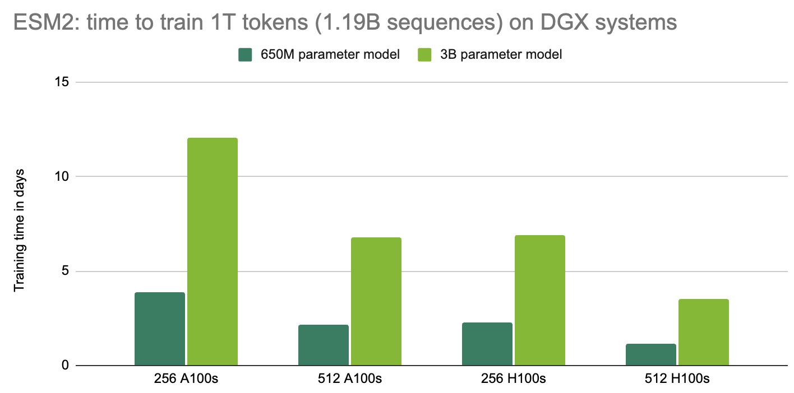
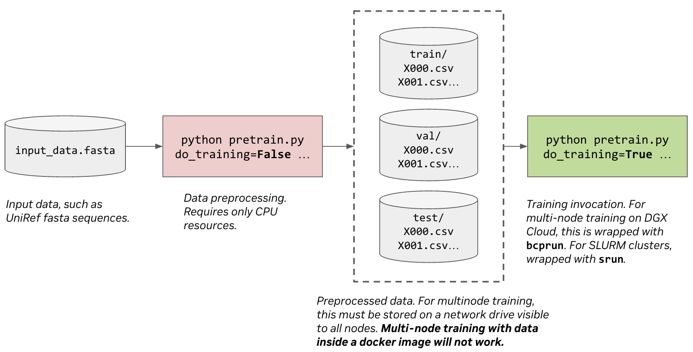
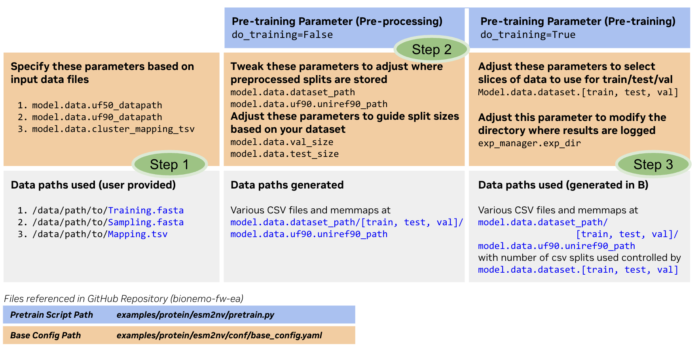

# NVIDIA BioNeMo (Early Access)

## Introduction

NVIDIA BioNeMo is a framework for training and deploying large biomolecular language models at supercomputing scale for the discovery and development of therapeutics. The large language model (LLM) framework currently has models for small molecules (SMILES) and protein sequences. More information about the models and their training is available in the [model guides](http://10.110.42.241:8082/models/esm2-nv.html).

BioNeMo relies on [NeMo](https://github.com/NVIDIA/NeMo). NeMo provides a robust environment for developing, training, and deploying deep learning models, including Megatron models. NeMo provides enhancements to [PyTorch Lighting](https://lightning.ai/) such as hyperparameter configurability with YAML files and checkpoint management. It also enables the development and training of large transformer models using NVIDIA's [Megatron](https://github.com/NVIDIA/Megatron-LM) framework, which makes multi-GPU, multi-node training with data parallelism, model parallelism, and mixed precision easily configurable. The [NeMo User Guide](https://docs.nvidia.com/deeplearning/nemo/user-guide/docs/en/main/) contains more information about all of these features. It is highly suggested to review at least the [NeMo Fundamentals](https://docs.nvidia.com/deeplearning/nemo/user-guide/docs/en/stable/starthere/tutorials.html) tutorial to understand how to configure jobs.

Note that this repository is in *early access*, therefore some parts are still under construction.

## Quick Start

An NGC API KEY is required for these steps.  You will need to configure [NGC](https://catalog.ngc.nvidia.com/?filters=&orderBy=weightPopularDESC&query=) with your org and team. See also Prerequisites below.

```bash
# Clone repository:
git clone https://github.com/NVIDIA/bionemo-fw-ea.git
cd bionemo-fw-ea

# Invoke launch script -- the first time, it will create a .env file and exit:
./launch.sh

# Edit the .env file with the correct NGC parameters for your org/team.
# Please reach out to NVIDIA if you do not know these values:
vim .env # You can use your favorite text editor. We use vim
NGC_CLI_API_KEY= # API key used to login to docker
NGC_CLI_TEAM= # Your team name
NGC_CLI_ORG= # Your organization name

# Pull the latest BioNeMo image:
#   Time estimate: 5min  
./launch.sh pull

# Download all pretrained checkpoints from NGC:
#   Time estimate: 10min
./launch.sh download

# Launch an interactive session inside the pulled image:
./launch.sh dev
```

Once the container is running, you can run the training and inference examples, see [BioNeMo Framework Tutorials](https://docs.nvidia.com/bionemo-framework/latest/tutorials-fw.html), or develop and test your own code.

As an example, For ESM1-nv, ESM2-nv, and ProtT5-nv, we provide an `infer.sh` script under `examples/protein/<MODEL_NAME>`, to run inference in offline mode (without running a remote inference client).
Users must specify an input CSV file with sequence data, and a CONFIG file with model specifics and data paths. Example config files are provided at  `examples/protein/<MODEL_NAME>/conf`. Example input data file is provided at `examples/tests/test_data/protein/test/x000.csv`.
The following is an example use of `infer.sh` to run inference on ESM2-nv using a csv file with sequence data. We use the `infer.yaml` config available at `examples/protein/esm2nv/conf/infer.yaml`. This config contains the `model.data.dataset` variable that can also be used to set the input file - in our example we override this default to point to an example file we include in the BioNeMo Framework codebase.
The set of commands below generates a pickle file with the embeddings of all sequences, at `$BIONEMO_HOME/data/bionemo_esm2_example.pkl`, specified by `model.data.output_fname`.

```bash
# Set the path to your local BioNeMo Framework codebase using the BIONEMO_HOME variable. In the docker container, this is set to /workspace/bionemo by default.
BIONEMO_HOME='/workspace/bionemo' # This is the default value
cd $BIONEMO_HOME
# Ensure you have downloaded the model checkpoints already - if not, run this command.
# It will use your NGC credentials stored in $BIONEMO_HOME/.env (Company specific).
# And download all model checkpoints to the 'LOCAL_MODELS_PATH' or 'DOCKER_MODELS_PATH' variable in the .env file (default: $BIONEMO_HOME/models)
./launch.sh download
# Next we navigate to the location of infer.sh and set up the required variables.
cd $BIONEMO_HOME/examples/protein/esm2nv/
example_file=$BIONEMO_HOME/examples/tests/test_data/protein/test/x000.csv
config_name='infer.yaml'
restore_from_path=$BIONEMO_HOME/models/protein/esm2nv/esm2nv_650M_converted.nemo
outfile=$BIONEMO_HOME/data/bionemo_esm2_example.pkl
./infer.sh --config-name "$config_name" ++model.data.output_fname="$outfile" ++model.data.dataset_path="$example_file" ++model.downstream_task.restore_from_path="$restore_from_path"
```
A successful execution of this command will result in command-line output similar to
```
[NeMo I 2023-12-15 18:24:21 infer:152] Saving 9 samples to output_fname = /workspace/bionemo/data/bionemo_ems2_example.pkl
```

More tutorials using ESM inference can be found [here.](http://10.110.42.241:8082/inference-grpc-fw.html)

## Prerequisites

BioNeMo containers and pre-trained models are delivered via [NVIDIA GPU Cloud (NGC)](https://catalog.ngc.nvidia.com/?filters=&orderBy=weightPopularDESC&query=), therefore it is recommended to create an NGC account, [download the NGC CLI](https://ngc.nvidia.com/setup), and generate API keys for access.

Additional requirement for this quickstart:
1. **'sudo-less' docker commands** The script launch.sh executed docker commands without a sudo prefix, so your environment's username must be added to the docker group, see Step 2 at [docker-on-ubuntu-22-04](https://www.digitalocean.com/community/tutorials/how-to-install-and-use-docker-on-ubuntu-22-04).

2. [Installing the NVIDIA Container Toolkit](https://docs.nvidia.com/datacenter/cloud-native/container-toolkit/latest/install-guide.html). If the the 'nvidia container toolkit' is not installed, you may see an error like
```
docker: Error response from daemon: could not select device driver "" with capabilities: [[gpu]].
```
See related discussion at [could-not-select-device-driver-with-capabilities-gpu](https://forums.developer.nvidia.com/t/could-not-select-device-driver-with-capabilities-gpu/259324)

3. **Optional environment customizations**  To add aliases and environment variables to the running docker container shells, first copy the files with aliases and env variables from your machine to the running docker container, by executing the follow command from your your machine, outside the running container:
```
docker cp some_file_with_aliases_or_env_vars:/workspace/some_file_with_aliases_or_env_vars
```
For example `some_file_with_aliases_or_env_vars` could be `.bash_aliases`.  Second, from the running container execute `source /workspace/some_file_with_aliases_or_env_vars`.  The aliases and env variables will be added to the current shell. 

## Implemented Models

The following is a list of models implemented inside BioNeMo. This means the models support all the scaling modes of NeMo (tensor parallelism, pipeline parallelism), mixed precision modes, and are ready-to-train on multi-node environments, particularly [DGX Cloud](https://www.nvidia.com/en-us/data-center/dgx-cloud/). Pretraining scripts can be found in `examples/{protein,molecule}/<MODEL_NAME>/pretrain.py`, and will require [dataset configuration](#using-your-own-data) before running. Preset model configuration files for training can be found in `examples/{protein,molecule}/<MODEL_NAME>/conf`:

| Model Name | Preset Configs | Min. Required GPUs (80GB memory, fp16) | Model Description |
|------------|-----------------|-------------------|----------|
| **ESM2nv** 8M parameter model   | `pretrain_esm2_8M.yaml`         | 1           | LLM for protein embeddings, [Lin et al.](https://www.science.org/doi/10.1126/science.ade2574) |
| 650M parameter model           | `pretrain_esm2_650M.yaml`       |  1                 |
| 3B parameter model           | `pretrain_esm2_3B.yaml`         |   2                |
| 30B parameter model           | `pretrain_esm2_15B.yaml`       |     8              |
| **ESM1nv**     | `pretrain_small.yaml`         | 1           | LLM for protein embeddings, [Rives et al.](https://www.pnas.org/doi/full/10.1073/pnas.2016239118)
| **MegaMolBart** |  `pretrain_xsmall_span_aug.yaml`| 1        | LLM for small molecules, similar to [Irwin et al.](https://iopscience.iop.org/article/10.1088/2632-2153/ac3ffb)
|            | `pretrain_small_span_aug.yaml`         |   1                |
|            | `pretrain_large_span_aug.yaml`         |   1                |
| **ProtT5nv** |  `pretrain_small.yaml`| 1         | LLM for protein embeddings, [Elnaggar et al.](https://arxiv.org/pdf/2007.06225.pdf), [Sevgen et al.](https://www.biorxiv.org/content/10.1101/2023.01.23.525232v1.full.pdf) |

The models were tested on DGX-A100 and DGX-H100 systems, on GPUs with 80GB of memory. Many of the models are expected to run on consumer-grade GPUs with less than 80GB of meomory, and if memory issues are encountered it is suggested to reduce the `micro_batch_size` in the configuration files. A detailed list of system requirements is available in the [Installation Section](##Installation).

Sample benchmarks for ESM2 pretraining:


Furthermore, we provide preset configation files for training downstream tasks on top of the core models (with or without frozen weights):
| Downstream Task Config | Compatible Foundation | Description |
|----------------------|-----------------------|-------------|
| `downstream_flip_sec_str.yaml` | ESM2nv, ESM1nv, ProtT5 | Protein secondary structure prediction, [Dallago et al.](https://www.biorxiv.org/content/10.1101/2021.11.09.467890v1) |
|`downstream_flip_meltome.yaml` | ESM2nv, ESM1nv, ProtT5 | Protein thermostability using Meltome Atlas, [Dallago et al.](https://www.biorxiv.org/content/10.1101/2021.11.09.467890v1), [Jarzab et al.](https://www.nature.com/articles/s41592-020-0801-4) |
|`downstream_flip_scl.yaml` | ESM2nv, ESM1nv, ProtT5 | Subcellular localization [Dallago et al.](https://www.biorxiv.org/content/10.1101/2021.11.09.467890v1) |
|`downstream_retro_uspto50k.yaml` | MegaMolBart | Retrosynthesis, [D. M. Lowe](https://www.repository.cam.ac.uk/items/dbb4f258-8f3c-4b59-9b5c-62fac7ca8c28) |
| `finetune_config.yaml` | MegaMolBart | Finetuning on PhysChem dataset, [Wu et al.](https://pubs.rsc.org/en/content/articlelanding/2018/sc/c7sc02664a) |

## Documentation

[BioNeMo Documentation VDR Mirror](http://10.110.42.241:8082/)

## Installation

BioNeMo is only supported on x86 Linux systems. If you are not on such a system, you **must** use the project's Docker images to develop and execute BioNeMo code.

System Requirements:
* Docker (with GPU support, docker engine >= 19.03).
* Python 3.10 or above
* Pytorch 1.13.1 or above
* [NeMo pinned to version 1.20](https://github.com/NVIDIA/NeMo/releases/tag/v1.20.0)
* NVIDIA GPU, if you intend to do model training. BioNeMo is compatible with most NVIDIA GPUs, with some incompatibility:
    * Tested GPUs:
        * DGX-H100, A100, V100
        * RTX A6000, A8000
        * Tesla T4
        * GeForce RTX 2080 Ti
    * GPUs with known issues:
        * Tesla K80
    * [bfloat16 precision](https://en.wikipedia.org/wiki/Bfloat16_floating-point_format) requires an Ampere generation GPU or higher.


### Dockerized Install

The supported method of code development is using a prebuilt BioNeMo container which is [available via the NGC registry](https://registry.ngc.nvidia.com/orgs/nvidian/teams/cvai_bnmo_trng/containers/bionemo-rc-v1.0). This container can be pulled via the registry directly `docker pull nvcr.io/nvidian/cvai_bnmo_trng/bionemo-rc-v1.0:latest` or via the launch script, `./launch.sh pull`. `./launch.sh dev` will start an interactive shell inside the container.

Optionally, after the container is started, you can attach to the running container via the VSCode [Docker](https://code.visualstudio.com/docs/containers/overview) and [VSCode Dev Container](https://code.visualstudio.com/docs/devcontainers/containers) extensions.

### Local Development

You must run all `bionemo` code, including tests, within a Docker container from the `bionemo` image. The recommended workflow is to run `./launch.sh dev` and then perform all commands from this development container. You may run `./launch.sh build` whenever you need to rebuild the image. Note that you must restart the development container each time you make a new image.

### `download_all`
Before you begin development, you must run `./launch.sh download_all` on your **host machine**. The `./launch.sh dev` command will volume-mount your local `git` repository clone and the `download_all` command will obtain models, datasets, and test data and place them within this local directory.

### `git-lfs`
Furthermore, some unit tests require data that is stored using `git-lfs`. You must install this on your host machine and set it up. Complete instructions are accessible [from the `git-lfs` project page](https://github.com/git-lfs/git-lfs). An abgrided set of instructions are as follows (assuming you are in the `bionemo` repository root):
```bash
sudo apt install git-lfs
git lfs install
git lfs pull
```

### Running `pytest` Tests
To run tests using `pytest`, execute the following command:
```bash
# Run tests to check setup
pytest -v --durations=0 --cov=bionemo --cov-report term --cov-report xml:coverage.xml -k "not test_model_training" .
```
Note, some tests require pretrained model checkpoints -- see below.

## Downloading Pretrained Models

The BioNeMo framework is released with pre-trained checkpoints for inference or as a starting point for further training/finetuning. Models are release via [NGC](https://catalog.ngc.nvidia.com/models), and can be downloaded via the NGC CLI. `./launch.sh download` can also be used to download the models, assuming your NGC account has been created and your `NGC_CLI_API_KEY` is set inside the `.env` file. Make sure you have your environment configure as described [in the Quickstart](##quick-start).
```bash
./launch.sh download
```

## Using Your Own Data

For all models, input data needs to be preprocessed to create `train/val/test` splits. The `pretrain.py` script in the `examples/` directory for each model will perform preprocessing if the parameter `do_training` is set to `False` which can be done via the `pretrain.py` script shipped with each model:



For many models, memory-mapped datasets are used and index files are written to disk before training begins. If after preprocessing your preprocessed data is stored as read-only, the config option `model.data.index_mapping_dir=/path/to/read-write/space` will need to be used.

How exactly data is used for each model is quite model specific, and unification of this is ongoing development work. Here, we exemplify the process for ESM2:


**Step 1**: Users must prepare 2 fasta files and a mapping tsv that explains the sampling process between the training sequences and the sequences to be sampled. Since sampling is done with replacement of the query sequence, we advise users to append the sequences from `Training.fasta` to the additional sampling sequences when generating `Sampling.fasta` and `Mapping.tsv`.
* Upon launching the docker container for preprocessing or pretraining, please ensure that the base config file points to the appropriately mounted paths for each of these files.

**Step 2**: Running the pretraining script with `do_training` set to `False` will use the paths specified in the base config to generate train/test/validation data splits (from `model.data.uf50_datapath` file, outputs stored at `model.data.dataset_path/[train,test,val]/`), the sampling data batches (from `model.data.uf90_datapath`, outputs stored at `model.data.uf90.uniref90_path/uf90_csvs`), and the mapping files to select the right sample sequence pool for each training sequence during training (from `model.data.cluster_mapping_tsv`, outputs stored at `model.data.uf90.uniref90_path`).
* When generating the training data splits into train, test, and val, BioNeMo separates a sample of size `model.data.val_size` for validation, and a non-overlapping sample of size `model.data.test_size`.
* By default, the train, test, val sequences are separated into 50 separate csv files, and the sampler sequences are also separated into 50 separate csv files. Each file is labelled `x000….x049` in the appropriate destination folder.


**Step 3**: Running the pretraining script with `do_training` set to `True` expects that preprocessing has completed and the required files have been generated at `model.data.dataset_path` and `model.data.uf90.uniref90_path`. The data files to pull from these paths are indicated at `model.data.dataset.[train,test,val]` in the base config, defaulting to the full set of csvs (`x[000…049]`).

## Repo Organization

The BioNeMo repo is organized by biological entity (molecule, protein) and by deep learning model, e.g. `molecule/megamolbart` or `protein/esm1nv`. Shared code can be found within `utils` files or directories. These are the most important directories and their purpose:

- `bionemo`: The library location, including functionality for data processing, data loading, models, and associated functions.
- `examples`: Contains files required to run training or inference: Python training scripts, YAML configuration files, shell scripts, and Jupyter notebooks.
- `models`: The location for tokenizers and trained models that can be [downloaded](#downloading-models).
- `setup`: Dockerfile and associated setup scripts.

## Code Development

Regardless of your system, the easiest way to develop and test code is to mount a local copy of the code inside the BioNeMo Docker container. While you may [build the image from the Dockerfile](./setup/Dockerfile), we encourage folks to use the [launcher script, `launch.sh`](./launch.sh).

The `launch.sh` script mounts the current working directory inside the container by default. This behavior can be customized by editing `BIONEMO_HOME` and `DOCKER_MOUTH_PATH`.

Before commiting code, make sure to setup the auto-formatter and linter via precommit hooks:
```bash
pip install pre-commit
pre-commit install
```

To push a commit on a branch with a merge request, the CI pipeline trigger can be avoided by including [skip ci] in the commit message.
**Warning**  If the [skip ci] tag is used for some commits on a branch with an MR, 
we ask that the final commit before merge should omit this tag, so that all 
continuous integration steps are triggered before the merge is attempted.

### VSCode into DGX Cloud
[Visual Studio Code](https://code.visualstudio.com/) is an extremely useful IDE for development and debugging. If you want to run a workload on NGC and develop with VSCode you can now do that seemlessly on our platform.

To startup a VSCode server, you must replace the `--command` portion of your `ngc base-command` command with
```bash
--commandline "\
PASSWORD=mypass code-server --auth password --bind-addr 0.0.0.0:8899 /workspace & \
sleep infinity"
```
This will tell DGX Cloud to sleep and wait for you to attach via the VSCode environment. Then you can run all your jobs through VSCode.


#### Sample command:
```bash
ngc base-command job run \
--name "myjobnamedummy" \
--priority HIGH \
--order 1 \
--preempt RUNONCE \
--min-timeslice 0s \
--ace nv-us-east-2 \
--org nvidian \
--team cvai_bnmo_trng \
--instance  dgxa100.80g.8.norm \
--image "nvidian/cvai_bnmo_trng/bionemo:latest" \
--port 8888 \
--port 8899 \
--total-runtime 8h  \
--result \results \
--commandline "\
PASSWORD=mypass code-server --auth password --bind-addr 0.0.0.0:8899 /workspace & \
sleep infinity"
```

Once that is done, take a look at the ngc [jobs](https://bc.ngc.nvidia.com/jobs) page and find your job. Under the `Service Mapped Ports` section, click
on the top port `8899` and you should be taken to a VSCode server.


### Build and Start Container from Source

The first time you run the [launch.sh](./launch.sh) script it will create a `.env` file for you. This file contains important environment variables that
can be used to build and push containers to a registry and start a container for interactive work. See the instructions inside the script for more information.

Once the `.env` file is created, a container can be pulled by running `./launch.sh pull`. The setup for BioNeMo training and inference is quite involved and requires the use of a Docker container. Due to this complexity, it is highly suggested to pull a prebuilt container. However, if a container must be built, it can be done by running `./launch.sh build`. Executing this command will require an [NGC API key](https://docs.nvidia.com/ngc/ngc-overview/index.html#generating-api-key) to be configured. If pushing to a registry is desired, `./launch.sh push` will complete this task.

Once a container has been built, it can be started in interactive mode with `./launch.sh dev`.


### Quick Links
For a detailed guide on setting up the repo and launching example jobs, checkout the [Quickstart Guide](http://10.110.42.241:8082/quickstart-fw.html) in the documentation.

For example data-processing, pretraining and inference setup, checkout the [Tutorials](http://10.110.42.241:8082/tutorials-fw.html).

### README TODO(trvachov)
Ensure NGC links to models, container work before release.
Ensure downloading models is pipecleaned, easy to use.
Ensure documentation links are changed before release.
