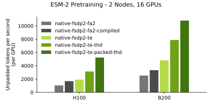

# TransformerEngine-accelerated ESM-2 training with native PyTorch training loop

This folder demonstrates how to train TE-accelerated ESM-2 with a native PyTorch training loop, including sequence
packing, FP8/MXFP8/NVFP4 precision with layer-wise control, using fully sharded data parallel (FSDP) for distributed
training.

## How to use this recipe

This folder contains an independent, minimal training example. It does not depend on any other code in the top-level
bionemo-framework repository. You can download a zipped directory of this folder alone by clicking
[here](https://download-directory.github.io?url=https://github.com/NVIDIA/bionemo-framework/tree/main/bionemo-recipes/recipes/esm2_native_te&filename=esm2-native-te).

### How to deploy this recipe on cloud providers

🚧 Under development

## Supported Models and Training Features

| Model                                     | BF16 | FP8<sup>[1]</sup> | MXFP8<sup>[2]</sup> | NVFP4<sup>[3]</sup> | THD Input Format | Context Parallelism |
| ----------------------------------------- | ---- | ----------------- | ------------------- | ------------------- | ---------------- | ------------------- |
| [ESM-2](../../models/esm2/README.md)      | ✅   | ✅                | ✅                  | ✅                  | ✅               | ✅                  |
| [AMPLIFY](../../models/amplify/README.md) | ✅   | ❌                | ❌                  | ❌                  | 🚧               | 🚧                  |

✅: Supported <br/>
🚧: Under development <br/>
❌: Not supported <br/>

\[1\]: Requires [compute capability](https://developer.nvidia.com/cuda-gpus) 9.0 and above (Hopper+) <br/>
\[2\]: Requires [compute capability](https://developer.nvidia.com/cuda-gpus) 10.0 and 10.3 (Blackwell), 12.0 support pending <br/>
\[3\]: Requires [compute capability](https://developer.nvidia.com/cuda-gpus) 10.0 and above (Blackwell+) <br/>

### Installing Dependencies

The easiest way to get started with this recipe is to use the provided Dockerfile, which uses the latest NVIDIA PyTorch
base image to provide optimized versions of PyTorch and TransformerEngine. To build the container, run:

```bash
docker build -t esm2_native_te .
```

To run the container, run:

```bash
docker run -it --gpus all --network host --ipc=host --rm -v ${PWD}:/workspace/bionemo esm2_native_te /bin/bash
```

Alternatively, the dependencies can be installed manually in an environment with CUDA support. See
[Dockerfile.cuda](Dockerfile.cuda) for the process of installing dependencies in a fresh python environment (for e.g.,
CUDA 13.0):

```bash
uv venv --python 3.12 --seed /workspace/.venv
source /workspace/.venv/bin/activate
uv pip install torch==2.9.0 --index-url https://download.pytorch.org/whl/cu130
uv pip install wheel packaging psutil
pip install --no-build-isolation "flash-attn>=2.1.1,<=2.8.1"
pip install --no-build-isolation transformer-engine[pytorch]==2.9.0
uv pip install -r /requirements.txt
```

To build and run the CUDA base container, run:

```bash
docker build -t esm2_native_te_cuda -f Dockerfile.cuda .
docker run -it --gpus all --network host --ipc=host --rm -v ${PWD}:/workspace/bionemo esm2_native_te_cuda /bin/bash -c "pytest -v ."
```

### Performance Benchmarks



Note: "compiled" refers to `torch.compile`. "fa2" is [FlashAttention2](https://github.com/Dao-AILab/flash-attention).
Recently, we measured 2800 tokens/second/GPU training speed on H100 with HuggingFace Transformers's ESM-2 implementation
of THD sequence packing, however we have not been able to make this configuration work on Blackwell and this work is
still in progress.

### Low precision performance benchmarks

In the above plot, we can see that as we increase the scale of our models, the benefits of low precision training are apparent.
This is because at smaller parameter models (such as 650M, 3B) etc, the cost to quantize activations from high precision to low
precision outweights the benefits of performing matrix multiplication with low precision. However, as our models scale up in
parameter count, the fixed quantization cost is lower than our GEMM operational savings.

Note: these plots were using our [fsdp2](./train_fsdp2.py) script.


### Convergence results for low precision training
#### MXFP8

In the above plot, for our ESM2-15B model that was trained with FSDP2 using 80 B300 GPUs nodes for 10 hours. We can clearly see that
our MXFP8 run and our BF16 baseline run have the same results. A perfect match in convergence.

#### NVFP4

In the above plot, for our ESM2-15B model, we show several lines. Each experiment shows a unique configuration using a custom
amount of `fp4_layers` per run (more info on how to enable this below). Moreover, the experiments can be read as
 `esm2-15b-b300-mxfp8-fp4_layer_start-fp4_layer_end-N-10-mbs-26-b300` which denotes at which point we start and end the fp4 layers.

We see that as we add more and more layers, our E2E training results get worse. This is a tradeoff between performance and
accuracy. If we look at the performance chart above, we have increased performance dramatically, but our accuracy suffers.
It's important to note that in all NVFP4 experiments we are also utilizing stochastic rounding and random hadamard transformations.

For more information regarding NVFP4 training please see [paper](https://arxiv.org/pdf/2509.25149) and [here](https://docs.nvidia.com/deeplearning/transformer-engine/user-guide/examples/fp8_primer.html)


### Distributed Training

This recipe supports distributed training using DDP, FSDP2, and Megatron-FSDP, shown in three separate training
entrypoints:

- [Distributed Data Parallel (DDP)](https://docs.pytorch.org/docs/stable/generated/torch.nn.parallel.DistributedDataParallel.html), shown in `train_ddp.py`
- [Fully Sharded Data Parallel 2 (FSDP2)](https://docs.pytorch.org/docs/stable/distributed.fsdp.fully_shard.html), shown in `train_fsdp2.py`
- [Megatron-FSDP (mFSDP)](https://github.com/NVIDIA/Megatron-LM/tree/main/megatron/core/distributed/fsdp/src), shown in `train_mfsdp.py`

## Commands to Launch Training

To run single-process training on one GPU, run:

```bash
python train_ddp.py  # or train_fsdp2.py / train_mfsdp.py
```

To run multi-process training locally on 2+ GPUs, run (e.g. 2 GPUs):

```bash
torchrun --nproc_per_node=2 train_fsdp2.py  # or train_mfsdp.py / train_ddp.py
```

Multi-Node training is supported with all three strategies, see [`slurm.sh`](slurm.sh) for an example SLURM script.

### Quantized Training (FP8 / MXFP8 / NVFP4)

To run training with FP8, enable it via `fp8_config.enabled=true`. By default, all transformer layers will use FP8.

```bash
python train_fsdp2.py --config-name L0_sanity fp8_config.enabled=true
```

Similarly, to train with NVFP4 quantization:

```bash
python train_fsdp2.py --config-name L0_sanity fp4_config.enabled=true
```

Additional recipe parameters (e.g., switching to `MXFP8BlockScaling`) can be set via the hydra configuration.

#### Layer-Wise Precision

You can control which transformer layers use FP8 or FP4 by specifying 1-indexed layer numbers via `fp8_layers` and
`fp4_layers`. Layers not assigned to either format will run in BF16.

For example, to run layers 1-3 in FP8, layers 4-6 in FP4, and the rest in BF16 on a model with more than 6 layers:

```bash
python train_fsdp2.py --config-name L0_sanity \
  fp8_config.enabled=true \
  fp4_config.enabled=true \
  'fp8_layers=[1,2,3]' \
  'fp4_layers=[4,5,6]'
```

When both `fp8_config` and `fp4_config` are enabled but only one layer list is provided, the other format automatically
claims the remaining layers. For example, if `fp8_layers=[1,2,3]` is set and `fp4_config.enabled=true` with no
`fp4_layers`, then layers 4 through N will default to FP4.

#### Quantization Stats Debugging

We provide a mechanism to log tensor statistics (activations, weights, gradients) for quantized layers during training.
When layer-wise precision is used, the stats config is automatically updated so that only the relevant layers are
tracked.

To enable stats logging:

```bash
python train_fsdp2.py \
  quant_stats_config.enabled=true \
  quant_stats_config.quant_log_dir=./logs/quant_stats \
  quant_stats_config.quant_stats_file=./fp8_debugging_stats.yaml \
  fp8_config.enabled=true
```

Note: This feature is available for the `train_ddp` and the `train_fsdp2` scripts. It is not yet available for
`train_mfsdp`. NVFP4 stats logging is not yet supported and will be enabled in a future TransformerEngine release;
FP8/MXFP8 stats logging works today.

The config file structure [fp8_debugging_stats.yaml](fp8_debugging_stats.yaml) is explained in the
[NVIDIA Transformer Engine config file documentation](https://docs.nvidia.com/deeplearning/transformer-engine/user-guide/debug/2_config_file_structure.html)
in more detail.

Stats collection has a performance cost dependent on the `freq` parameter in the config file. `freq=1` collects stats
on every step which in our experiments caused a ~29% decrease in throughput (executed on a single RTX 5090). We
recommend using `freq>=10` to reduce this performance hit.

### Sequence Packing (THD input format)

Sequence packing is handled via a padding-free collator (in `collator.py`) that provides input arguments (e.g.
`cu_seq_lens_q`) needed for padding-free attention. To enable sequence packing, set `use_sequence_packing=true`
in the hydra configuration.

```bash
python train_fsdp2.py --config-name L0_sanity use_sequence_packing=true
```

### FP8 and Sequence Packing

To combine FP8 training with sequence packing, the number of unpadded input tokens must be a multiple of 16. The data
collator will automatically pad packed sequences to the maximum number of tokens per batch.

```bash
python train_fsdp2.py --config-name L0_sanity \
  fp8_config.enabled=true \
  use_sequence_packing=true
```

### Context Parallelism

We provide a training script [train_ddp_cp](./esm2_native_te/train_ddp_cp.py) and a sample config [L0_sanity_cp](./hydra_config/L0_sanity_cp.yaml) that uses context parallelism.

In the config the argument `--cp_size` allows the user to set the size of the context parallel distributed group. When paired with Distributed Data Parallelism (DDP), the number of context parallel groups will be determined by `world_size//cp_size`.

Thus, for example, if a user has 8 processes and sets `cp_size=2` they will have `2` CP groups and `4` DDP groups. During dataloading we make no assumptions about the data pipeline being deterministic or not. DDP groups will provide unique data while CP groups will contain replicates of that data.

For example, let's say that we have 2 DDP groups and 2 CP groups. Each DDP group will have a unique dataloader DP0 for DDP group 0
and DP1 for DDP group 1. CP works by running something called ring attention, which expects tokens to live on each device in a particular layout. For this CP implementation we use something called [Dual Chunk Swapping](https://github.com/NVIDIA/TransformerEngine/blob/1df4a69f761672f633d40ea3605327087d1ea737/transformer_engine/pytorch/attention/dot_product_attention/context_parallel.py#L3714-L3770). If DP0 outputs sequence `1 2 3 4 5 6 7 8` and DP1 outputs `9 10 11 12 13 14 15 16` then when we run through the `CPAwareDataloader` defined in [datasets](./dataset.py), the dataloader will create CP shards from that DP group as follows:

```
      |   DP0   |    DP1        |
  CP0 | 1,2,7,8 | 9, 10, 15, 16 |
  CP1 | 3,4,5,6 | 11, 12, 13, 14|
```

You may notice these shards and wonder why they are the way they are. We did. The reason is that CP groups are sharded using slices. The full input sequence (such as `1 2 3 4 5 6 7`) is sliced into `2 * cp_size` groups. Then CP0 takes the first and last slice, while CP1 takes the middle slices, of each sequence.

In this example we only show one sequence but its important to note that slicing takes place on every sequence, so if a second sequence is also available, that will be sliced in the same manner. CP0 will take the first and last slice of every sequence, while CP1 will take the middle slices of each sequence.

### Comparing Against the HF Transformers Reference Implementation

To launch training with the ESM-2 model as implemented in HF Transformers, pass a `facebook/esm2` checkpoint as the
model tag:

```bash
python train_fsdp2.py --config-name L0_sanity model_tag=facebook/esm2_t6_8M_UR50D
```

## Downloading Pre-Training Data For Offline Training

An example pre-training dataset for ESM-2 is available in the
[`nvidia/esm2_uniref_pretraining_data`](https://huggingface.co/datasets/nvidia/esm2_uniref_pretraining_data) Hugging
Face dataset. This dataset can be [streamed](https://huggingface.co/docs/datasets/en/stream) from the Hugging Face Hub via

```python
>>> from datasets import load_dataset
>>> dataset = load_dataset('nvidia/esm2_uniref_pretraining_data', split='train', streaming=True)
>>> print(next(iter(dataset)))
{'sequence': 'MSPRRTGGARPPGPCTPCGPRPRCPSRRSAAARPAPSAAPARRARPGRRPGCRPGTDCPGTARRPGGGP...',
 'ur50_id': 'UniRef50_A0A081XN86',
 'ur90_id': 'UniRef90_UPI002FBE17D9'}
```

For large-scale training, the dataset should be downloaded locally via the [huggingface
CLI](https://huggingface.co/docs/huggingface_hub/guides/download#download-from-the-cli), with appropriate values set for
`HF_HOME` and `HF_TOKEN` environment variables. Use `uv tool install huggingface_hub` to install the CLI if not already
installed.

```bash
export HF_TOKEN=<your_huggingface_token>
hf download nvidia/esm2_uniref_pretraining_data --repo-type dataset --local-dir /path/to/download/directory
# Test to ensure the dataset can be loaded correctly
python -c "import datasets; datasets.load_dataset('/path/to/download/directory', split='train', streaming=True)"
```

Pass the downloaded dataset directory to the training script as the `dataset.path` configuration parameter.

```bash
HF_DATASETS_OFFLINE=1 python train_fsdp2.py --config-name L0_sanity \
  dataset.load_dataset_kwargs.path=/path/to/download/directory
```

## Saving and Loading Checkpoints

To enable checkpoint saving, ensure that `checkpoint.ckpt_dir` is set to a writable directory. Checkpointing frequency is
controlled by the `checkpoint.save_every_n_steps` configuration parameter.

```bash
python train_fsdp2.py --config-name L0_sanity \
  checkpoint.ckpt_dir=/path/to/ckpt_dir \
  checkpoint.save_every_n_steps=100
```

To enable checkpoint loading, set `checkpoint.resume_from_checkpoint=true` to resume from the latest checkpoint.

```bash
python train_fsdp2.py --config-name L0_sanity \
  checkpoint.ckpt_dir=/path/to/ckpt_dir \
  checkpoint.resume_from_checkpoint=true
```

We also show how to export a final model at the end of training, which is suitable for uploading to the Hugging Face Hub
or for local inference as a more durable format than torch distributed checkpoints. To enable this, set
`checkpoint.save_final_model=true` in the hydra configuration. The resulting model will be saved to the `final_model`
directory within the checkpoint directory.

Checkpointing is implemented for all three strategies, see [`checkpoint.py`](checkpoint.py) for more details.

## Saving Dataloader State with `StatefulDataLoader`

These examples show how to save and resume your dataloader by passing the dataloader instance to our `save_checkpoint_*`
and `load_checkpoint_*` functions using the `StatefulDataLoader` class from `torchdata`. See `checkpoint.py` for
implementation details.

For references on `StatefulDataLoader` and it's integration with `datasets` see:

- https://github.com/meta-pytorch/data/tree/main/torchdata/stateful_dataloader
- https://huggingface.co/docs/datasets/en/stream#save-a-dataset-checkpoint-and-resume-iteration

Known limitations:

- When loading the dataloader from a saved checkpoint, you must provide the same `num_workers` that you used to save the
  dataloader state, because state is saved at the worker-level.
- Moreover, dataloader state is saved on a per-rank basis. So if you resume training and load the dataloader with a
  different amount of nodes / gpus that was used when you saved the dataloader the state will not resume perfectly.

## Running Inference with the Trained Model

Models can be loaded from the final checkpoint directory using the `AutoModel.from_pretrained` method. For example:

```python
from transformers import AutoModel, AutoTokenizer

model = AutoModel.from_pretrained("path/to/final_model")
tokenizer = AutoTokenizer.from_pretrained("...")

gfp_P42212 = (
    "MSKGEELFTGVVPILVELDGDVNGHKFSVSGEGEGDATYGKLTLKFICTTGKLPVPWPTL"
    "VTTFSYGVQCFSRYPDHMKQHDFFKSAMPEGYVQERTIFFKDDGNYKTRAEVKFEGDTLV"
    "NRIELKGIDFKEDGNILGHKLEYNYNSHNVYIMADKQKNGIKVNFKIRHNIEDGSVQLAD"
    "HYQQNTPIGDGPVLLPDNHYLSTQSALSKDPNEKRDHMVLLEFVTAAGITHGMDELYK"
)

inputs = tokenizer(gfp_P42212, return_tensors="pt")
model.eval()
output = model(**inputs)
```

## Performance

🚧 Under development

## See Also

- [ESM-2 Training with Accelerate](../esm2_accelerate_te/README.md)

## Developer Guide

### Running tests

To run tests locally, run `recipes_local_test.py` from the repository root with the recipe directory as an argument.

```bash
./ci/scripts/recipes_local_test.py bionemo-recipes/recipes/esm2_native_te/
```

Tests should be kept relatively fast, using the smallest model and number of training steps required to validate the
feature. Hardware requirements beyond those used in CI (e.g., a single L4) should be annotated with
pytest.mark.requires, e.g. `requires_fp8` and `requires_multi_gpu`.

### Development container

To use the provided devcontainer, use "Dev Containers: Reopen in Container" from the VSCode menu, and choose the
"BioNeMo Recipes Dev Container" option. To run the tests inside the container, run `pytest -v .` in the recipe
directory.

### Hydra Tips

[Hydra](https://hydra.cc/) is a powerful configuration management library for Python. This recipe uses Hydra to manage
training configurations, allowing for easy modification of training hyper-parameters and model settings.

Configuration parameters can be overridden from the command line, e.g.
`python train_fsdp2.py --config-name L0_sanity fp8_config.enabled=true`.

For verbose logging, use the hydra command line override `hydra.verbose=true`, see
https://hydra.cc/docs/tutorials/basic/running_your_app/logging/ for more details.
