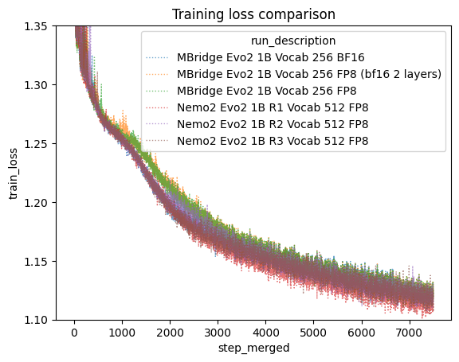

# Evo2 Recipe

A self-contained training, inference, and checkpoint conversion recipe for Evo2 models
(Hyena SSM and Eden/Llama architectures) built on Megatron Bridge.

## Installation

```bash
# 1. Create venv (CRITICAL: include system packages so it sees the container's PyTorch)
export UV_LINK_MODE=copy
uv venv --system-site-packages --seed /workspace/.venv

# 2. Activate the environment
source /workspace/.venv/bin/activate
pip freeze | grep transformer_engine > pip-constraints.txt
uv pip install -r build_requirements.txt --no-build-isolation  # some extra requirements are needed for building
uv pip install -c pip-constraints.txt -e . --no-build-isolation
```

## CLI tools

All CLI tools are defined in `pyproject.toml` under `[project.scripts]`.

| Command                           | Description                                           |
| --------------------------------- | ----------------------------------------------------- |
| `train_evo2`                      | Train or fine-tune Hyena and Eden models              |
| `infer_evo2`                      | Autoregressive text generation (greedy/sampling)      |
| `predict_evo2`                    | Batch log-likelihood scoring on FASTA sequences       |
| `preprocess_evo2`                 | Convert FASTA files to Megatron indexed binary format |
| `splice_evo2`                     | Extract spliced transcripts from FASTA + GTF files    |
| `evo2_convert_nemo2_to_mbridge`   | Convert NeMo2 checkpoints to MBridge DCP format       |
| `evo2_convert_savanna_to_mbridge` | Convert Savanna checkpoints to MBridge DCP format     |
| `evo2_export_mbridge_to_vortex`   | Export MBridge checkpoint to Vortex `.pt` format      |

Run any tool with `--help` for full usage details.

## Quick start

### Training with mock data (Hyena)

```bash
torchrun --nproc-per-node 2 --no-python \
  train_evo2 \
  --hf-tokenizer-model-path tokenizers/nucleotide_fast_tokenizer_256 \
  --model-size striped_hyena_1b_nv_parallel --max-steps 12 --eval-interval 10 \
  --eval-iters 3 --mock-data \
  --micro-batch-size 16 --global-batch-size 32 --seq-length 1024 \
  --tensor-model-parallel 1 \
  --use-precision-aware-optimizer --dataset-seed 33 \
  --seed 41 --spike-no-more-embedding-init \
  --no-weight-decay-embeddings --cross-entropy-loss-fusion \
  --align-param-gather --overlap-param-gather --grad-reduce-in-fp32 \
  --decay-steps 100 --warmup-steps 10 \
  --mixed-precision-recipe bf16_with_fp8_current_scaling_mixed \
  --no-fp32-residual-connection --activation-checkpoint-recompute-num-layers 1 \
  --attention-dropout 0.001 --hidden-dropout 0.001 \
  --eod-pad-in-loss-mask --enable-preemption \
  --log-interval 5 --debug-ddp-parity-freq 10 \
  --result-dir tmpfp8 --no-renormalize-loss
```

### Training with mock data (Eden / Llama)

```bash
torchrun --nproc-per-node 1 --no-python \
  train_evo2 \
  --hf-tokenizer-model-path tokenizers/nucleotide_fast_tokenizer_512 \
  --model-size eden_7b --num-layers 2 --max-steps 5 --eval-interval 5 \
  --eval-iters 1 --mock-data \
  --micro-batch-size 4 --global-batch-size 4 --seq-length 64 \
  --tensor-model-parallel 1 --pipeline-model-parallel 1 --context-parallel 1 \
  --mixed-precision-recipe bf16_mixed \
  --no-activation-checkpointing \
  --decay-steps 1000 --warmup-steps 10 \
  --log-interval 1 --seed 41 --dataset-seed 33 \
  --result-dir eden_test
```

Eden models automatically set `fp32_residual_connection = False` during training.

### Autoregressive generation (`infer_evo2`)

Generate DNA sequences from a prompt using an MBridge checkpoint:

```bash
torchrun --nproc_per_node 1 --no-python \
  infer_evo2 \
  --ckpt-dir /path/to/mbridge/checkpoint \
  --prompt "ATCGATCGATCGATCG" \
  --max-new-tokens 200 \
  --temperature 1.0 \
  --output-file generated.txt
```

Options:

- `--ckpt-dir` — path to MBridge checkpoint directory (required).
- `--prompt` / `--prompt-file` — input sequence (inline or from file).
- `--max-new-tokens` — number of tokens to generate (default: 100).
- `--temperature` — sampling temperature (default: 1.0).
- `--top-k` / `--top-p` — top-k or nucleus sampling (0 = disabled).
- `--tensor-parallel-size` — tensor parallelism for large models (default: 1).
- `--max-seq-length` — maximum sequence length (default: 8192).

### Batch sequence scoring (`predict_evo2`)

Compute log-likelihoods for sequences in a FASTA file:

```bash
torchrun --nproc_per_node 1 --no-python \
  predict_evo2 \
  --fasta /path/to/sequences.fasta \
  --ckpt-dir /path/to/mbridge/checkpoint \
  --output-dir predictions/ \
  --micro-batch-size 4 \
  --write-interval epoch
```

Options:

- `--fasta` — input FASTA file (required).
- `--ckpt-dir` — MBridge checkpoint directory (required).
- `--output-dir` — directory for output prediction files.
- `--output-log-prob-seqs` — output log probabilities instead of raw logits.
- `--log-prob-collapse-option` — aggregation: `sum`, `mean`, or `per_token`.
- `--embedding-layer` — extract embeddings from a specific layer instead of logits
  (supports negative indexing, e.g., `-1` for last layer).
- `--mask-phylogenetic-tags` — mask phylogenetic tags in loss computation.

### Data preprocessing (`preprocess_evo2`)

Convert FASTA files into Megatron's indexed binary format for training:

```bash
preprocess_evo2 --config preprocess_config.yaml
```

The config YAML specifies input FASTA paths, output directory, train/val/test splits,
tokenizer settings, and preprocessing options. See the `fine-tuning-tutorial.ipynb`
notebook in `examples/` for a complete example.

### Transcript extraction (`splice_evo2`)

Extract spliced transcripts from a genome FASTA and GTF annotation:

```bash
splice_evo2 \
  --fasta-path genome.fa \
  --gtf-path annotations.gtf \
  --output-path transcripts.fa \
  --only-longest-transcript
```

Options:

- `--transcript-type` — `default` or `stitched` (includes promoter + intron context).
- `--stitched-promoter` — bp to include from promoter region (default: 1024).
- `--stitched-intron` — bp from neighboring introns (default: 32).
- `--only-longest-transcript` — keep only the longest transcript per gene.

## Fine-tuning from an existing checkpoint

### From NeMo2 checkpoints (NGC)

Convert the checkpoint from NeMo2 format, then fine-tune:

```bash
CKPT_NAME=evo2/1b-8k-bf16:1.0
CKPT_OUT_DIR=evo2_1b_8k_bf16_mbridge
evo2_convert_nemo2_to_mbridge \
  --mixed-precision-recipe bf16_with_fp8_current_scaling_mixed \
  --tokenizer-path tokenizers/nucleotide_fast_tokenizer_512 \
  --model-size evo2_1b_base \
  --seq-length 8192 \
  --nemo2-ckpt-dir $(download_bionemo_data $CKPT_NAME) \
  --mbridge-ckpt-dir $CKPT_OUT_DIR
```

Good checkpoint names to try are:

- `evo2/1b-8k-bf16:1.0` (model_size: `evo2_1b_base`)
- `evo2/7b-1m:1.0` (model_size: `evo2_7b`)
- `evo2/40b-1m-fp8-bf16:1.0` (model_size: `evo2_40b`)

Other than the 7b version, the other two are checkpoints fine-tuned by the BioNeMo team to support both FP8 and BF16
precision. The 7b version worked well on both FP8 and BF16 out of the box so it was not fine-tuned further. If you do
want to use one of the FP8 sensitive checkpoints, like `evo2/40b-1m` then be sure to add the `--vortex-style-fp8`
option to the checkpoint conversion step. Also note that although 8k versions of the 7b and 40b checkpoints exist,
it is advisable to use the longer context versions since they were trained further and still run on shorter inputs.

See `download_bionemo_data --list-resources` for other checkpoint options and a list of available
downloadable resources.

Now fine-tune with `--finetune-ckpt-dir`. If you have problems with
`bf16_with_fp8_current_scaling_mixed` try `bf16_mixed`.

```bash
torchrun --nproc-per-node 2 --no-python \
  train_evo2 \
  --hf-tokenizer-model-path tokenizers/nucleotide_fast_tokenizer_512 \
  --model-size evo2_1b_base --max-steps 12 --eval-interval 10 \
  --eval-iters 3 --mock-data \
  --micro-batch-size 16 --global-batch-size 32 --seq-length 1024 \
  --tensor-model-parallel 1 \
  --use-precision-aware-optimizer --dataset-seed 33 \
  --seed 41 \
  --cross-entropy-loss-fusion \
  --align-param-gather --overlap-param-gather --grad-reduce-in-fp32 \
  --decay-steps 100 --warmup-steps 10 \
  --mixed-precision-recipe bf16_with_fp8_current_scaling_mixed \
  --no-fp32-residual-connection --activation-checkpoint-recompute-num-layers 1 \
  --attention-dropout 0.001 --hidden-dropout 0.001 \
  --eod-pad-in-loss-mask --enable-preemption \
  --log-interval 5 --debug-ddp-parity-freq 10 \
  --result-dir tmpfp8-ft-example --no-renormalize-loss \
  --finetune-ckpt-dir $CKPT_OUT_DIR
```

### From Savanna checkpoints (HuggingFace)

ARC publishes Savanna-format checkpoints on HuggingFace for fine-tuning.
Convert to MBridge format first:

```bash
evo2_convert_savanna_to_mbridge \
  --savanna-ckpt-path arcinstitute/savanna_evo2_20b \
  --mbridge-ckpt-dir evo2_20b_mbridge \
  --model-size evo2_20b \
  --tokenizer-path tokenizers/nucleotide_fast_tokenizer_512 \
  --seq-length 8192
```

The `--savanna-ckpt-path` accepts either a local `.pt` file path or a HuggingFace
repo ID (e.g., `arcinstitute/savanna_evo2_1b_base`). Available Savanna checkpoints:

| HuggingFace Repo                     | Model Size      |
| ------------------------------------ | --------------- |
| `arcinstitute/savanna_evo2_1b_base`  | `evo2_1b_base`  |
| `arcinstitute/savanna_evo2_7b`       | `evo2_7b`       |
| `arcinstitute/savanna_evo2_20b`      | `evo2_20b`      |
| `arcinstitute/savanna_evo2_40b_base` | `evo2_40b_base` |

Options:

- `--no-te` — disable Transformer Engine fused layernorm key mapping (use if the
  checkpoint was saved without TE).
- `--mixed-precision-recipe` — precision recipe (default: `bf16_mixed`).
- `--verbose` / `-v` — enable debug logging.

## Exporting to Vortex format

Vortex is ARC Institute's inference format for Evo2 Hyena models, used by the
[evo2](https://github.com/ArcInstitute/evo2) inference repository. Export an MBridge
checkpoint to Vortex (`.pt`) using:

```bash
evo2_export_mbridge_to_vortex \
  --mbridge-ckpt-dir /path/to/mbridge/iter_0000001 \
  --output-path /path/to/output/model_vortex.pt \
  --model-size evo2_1b_base
```

The exporter converts MBridge distributed-checkpoint weights into the
single-file Vortex format expected by ARC's inference code. It handles
MLP weight splitting, Hyena filter pole/residue computation, and
layer-norm key remapping.

Options:

- `--model-size` — one of the `evo2_*` or `striped_hyena_*` Hyena model keys listed below.
- `--no-te` — disable Transformer Engine fused layernorm key mapping
  (use if the checkpoint was saved without TE).
- `--verbose` / `-v` — enable debug logging.

### Savanna → MBridge → Vortex round-trip

If you have a Savanna checkpoint and want to produce a Vortex file, chain
the two converters:

```bash
# Step 1: Savanna -> MBridge
evo2_convert_savanna_to_mbridge \
  --savanna-ckpt-path arcinstitute/savanna_evo2_1b_base \
  --mbridge-ckpt-dir /tmp/mbridge_1b \
  --model-size evo2_1b_base \
  --tokenizer-path tokenizers/nucleotide_fast_tokenizer_256

# Step 2: MBridge -> Vortex
evo2_export_mbridge_to_vortex \
  --mbridge-ckpt-dir /tmp/mbridge_1b/iter_0000001 \
  --output-path /tmp/evo2_1b_vortex.pt \
  --model-size evo2_1b_base
```

## Model naming convention

Model sizes are specified via `--model-size` and follow a naming convention that
disambiguates the model architecture, origin, and context length.

### Hyena (SSM) models

| Key                            | Description                  |
| ------------------------------ | ---------------------------- |
| `evo2_1b_base`                 | ARC 1B, 8K context           |
| `evo2_7b_base`                 | ARC 7B, 8K context           |
| `evo2_7b`                      | ARC 7B, 1M context           |
| `evo2_20b`                     | ARC 20B, 1M context          |
| `evo2_40b_base`                | ARC 40B, 8K context          |
| `evo2_40b`                     | ARC 40B, 1M context          |
| `striped_hyena_1b_nv`          | NVIDIA-modified 1B variant   |
| `striped_hyena_7b_nv`          | NVIDIA-modified 7B variant   |
| `striped_hyena_40b_nv`         | NVIDIA-modified 40B variant  |
| `striped_hyena_test`           | Tiny test model              |
| `striped_hyena_test_nv`        | Tiny test model (NV variant) |
| `striped_hyena_1b_nv_parallel` | NVIDIA 1B variant (parallel) |

Models prefixed with `evo2_` match the public ARC checkpoints on
Hugging Face (e.g., `arcinstitute/savanna_evo2_1b_base`). The `_base`
suffix denotes the 8K-context variant; without it, the model uses the
long (1M) context length. Models prefixed with `striped_hyena_` are
NVIDIA-modified variants that do not have a corresponding public ARC
checkpoint.

### Eden (Llama 3.1) models

| Key        | Description             |
| ---------- | ----------------------- |
| `eden_7b`  | Eden base (~8B params)  |
| `eden_11b` | Eden ~11B               |
| `eden_18b` | Eden ~18B               |
| `eden_21b` | Eden ~21B               |
| `eden_24b` | Eden ~24B (32K context) |
| `eden_27b` | Eden ~27B (32K context) |
| `eden_28b` | Eden ~28B               |
| `eden_35b` | Eden ~35B               |

Eden models use the Llama 3.1 architecture. They are supported by
`train_evo2`, `infer_evo2`, and `predict_evo2`. During training,
`fp32_residual_connection` is automatically set to `False` for Eden models.

## Examples

The `examples/` directory contains Jupyter notebooks demonstrating common workflows:

| Notebook                             | Description                                                |
| ------------------------------------ | ---------------------------------------------------------- |
| `zeroshot_brca1.ipynb`               | Zero-shot BRCA1 variant effect prediction with Evo2 1B     |
| `fine-tuning-tutorial.ipynb`         | Fine-tune the 1B checkpoint on human chromosomes           |
| `evo2_20b_finetune_and_export.ipynb` | Full 20B lifecycle: Savanna → MBridge → fine-tune → Vortex |

## Docker build

```bash
docker build -t evo2_megatron_recipe-$(git rev-parse --short HEAD) .
```

## Performance and accuracy comparisons

NOTE: this section is largely a work in progress. This reflects the most updated information, but may not reflect the
current state of the code base at any given time.

### Training accuracy convergence

We ran a 12 hour 48 H100 GPU training run to compare megatron bridge with nemo2. We found that FP8 current scaling
converges by around the 5,000th step to the bf16 lines. And that bf16 is comparable with nemo2. Interestingly in nemo2
bf16 and fp8 followed nearly identical trajectories for the first 5k steps as well. Note that in a typical training run
we are performing over 100k steps, so different behavior in the first 5k steps is less worrisome if the endpoints are
comparable.



### Training performance comparisons

FP8 current scaling which is supposed to have better convergence properties than delayed scaling, performs nearly as
well as delayed scaling in mbridge. Even leaving multiple transformer layers in bf16 precision trains faster than fp8
delayed scaling in nemo2.

|                   Evo2 1B Run                    | Seconds per step (lower is better) | Tokens/sec/GPU | Global Batch Size | Number of GPUs | Vocab Size |
| :----------------------------------------------: | :--------------------------------: | :------------: | :---------------: | :------------: | :--------: |
|                   MBridge BF16                   |                6.10                |     26,859     |        960        |       48       |    256     |
|              MBridge FP8 (delayed)               |                5.38                |     30,453     |        960        |       48       |    256     |
|              MBridge FP8 (current)               |                5.44                |     28,755     |        960        |       48       |    512     |
| MBridge FP8 (current first/last two layers bf16) |                5.47                |     28,598     |        960        |       48       |    512     |
|               Nemo2 FP8 (delayed)                |                6.18                |     26,511     |        960        |       48       |    512     |

Activation memory optimizations have enabled context parallelism to work better with evo2 style models in our mbridge
implementation than the previous nemo2 implementation. Since TP requires more node to node communication, you generally
want to limit TP to your fastest interconnects, which are typically configured in nodes of 8 GPUs. Evo2 would previously
OOM with these more ideal configurations, requiring much larger than typical levels of TP to handle long context
training. With our latest changes to the evo2 forward pass, we can now handle more typical TP vs CP configurations.
This enables significantly faster step timing at long context, as well as demonstrating up to 2M context length. We
have currently demonstrated small training runs at 2M context on only 512 H100 GPUs for the 40b parameter model.

|   Configuration   |  Precision  | TP  | CP  | Number of Nodes | Number of GPUs | Context Length | Global Batch Size | Seconds per Step |
| :---------------: | :---------: | :-: | :-: | :-------------: | :------------: | :------------: | :---------------: | :--------------: |
|       NeMo2       | fp8-delayed | 64  |  2  |       32        |      256       |       1M       |         2         |        44        |
|       NeMo2       | fp8-delayed |  8  | 16  |       32        |      256       |       1M       |         2         |       OOM        |
| MBridge Optimized |    bf16     |  8  | 16  |       32        |      256       |       1M       |         2         |        30        |
|  2M Stress Test   |    bf16     |  8  | 32  |       64        |      512       |       2M       |         2         |        48        |
