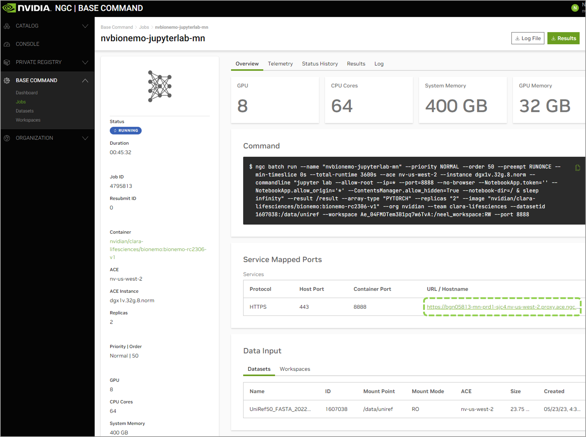
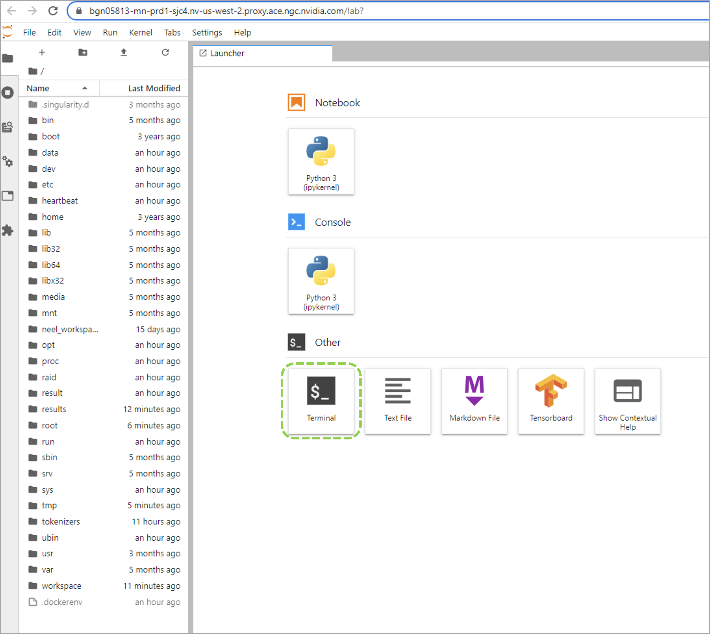

# Running BioNeMo With BCP

## Introduction to BCP

NVIDIA Base Command Platform (BCP) includes a central user interface with a set of managed compute resources. It can be used to manage datasets, workspaces, and jobs, as well as users within an organization and team. This creates a convenient hub for monitoring job execution, viewing metrics and logs, and monitoring resource utilization. NVIDIA DGX Cloud is powered by Base Command Platform. 

More information and CLI documentation can be found on the [BCP website](https://docs.nvidia.com/base-command-platform/index.html).

Before beginning, NGC CLI must be installed and configured to perform command-line tasks. Visit the [NGC user guide](https://docs.nvidia.com/base-command-platform/user-guide/index.html#installing-ngc-cli) for instructions.

### Training BioNeMo Models with BCP

The following reference script can be used to launch a job on a cluster running BCP from a local workstation using the NGC CLI. The [NGC web UI](https://docs.nvidia.com/base-command-platform/user-guide/index.html#jobs-and-gpu-instances) can also be used to configure and launch the job interactively. The script has comments with additional info about the specific commands. The example scripts are also available in `/workspace/bionemo/examples/protein/esm1nv/scripts/` in the BioNeMo container. Similar scripts are available for ProtT5nv and MegaMolBART in their respective directories.

In the configuration below, update `{deploy_ngc_org}` and `{deploy_ngc_team}` with the correct NGC org and team name, respectively. If there is no team name, then this can be omitted.

```bash
#!/bin/bash

NGC_ARRAY_SIZE=2                                    #number of nodes for the job
NGC_GPUS_PER_NODE=8                                 #number of gpus per node

WANDB_API_KEY=${WANDB_API_KEY:=NotSpecified}
WANDB_LOGGER_NAME=${WANDB_LOGGER_NAME:=esm1nv_2node_bs128_test1}

TRAINCMD="
export WANDB_API_KEY=${WANDB_API_KEY} && cd /workspace/bionemo/examples/protein/esm1nv && python pretrain.py  \\                                                  #Command to perform model pre-training
  --config-path=conf \\                             #Path to Config file
  --config-name=pretrain_small \\                   #Config parameters specified for a small pre-training test run 
  do_training=True \\                               #Additional model training parameters here onwards
  model.data.dataset_path=/data/uniref \\           #Note, this needs dataset to be preprocessed
  ++model.data.dataset.train=x_OP_000..009_CL_ \\   #subset of data to be used for model training
  ++model.data.dataset.val=x_OP_000..009_CL_ \\     
  ++model.data.dataset.test=x_OP_000..009_CL_ \\    
  exp_manager.exp_dir=/workspace/bionemo/nemo_experiments/esm1nv/pretrain_small-000-009 \\
  ++exp_manager.create_wandb_logger=True \\         #set False for disabling it
  ++exp_manager.wandb_logger_kwargs.offline=False \\               
  ++exp_manager.wandb_logger_kwargs.name=${WANDB_LOGGER_NAME}   
  ++trainer.devices=\\\$NGC_GPUS_PER_NODE \\
  ++trainer.num_nodes=\\\$NGC_ARRAY_SIZE \\
  model.validation.validation_enabled=False \\
  model.micro_batch_size=128 \\
  ++trainer.max_steps=100 \\
  ++trainer.val_check_interval=50 \\
  model.data.num_workers=0 \\
  ++model.tensor_model_parallel_size=1 \\
  ++trainer.accumulate_grad_batches=1 \\
  ++exp_manager.checkpoint_callback_params.always_save_nemo=False"


BCP_COMMAND="bcprun \\                              #bcprun command to launch the multi-node job 
  --debug \\
  --nnodes=\\\${NGC_ARRAY_SIZE} \\                  
  --npernode=\\\${NGC_GPUS_PER_NODE} \\
  --cmd \\\"${TRAINCMD}\\\" \
"

# Configure the main command to be launched for submitting NGC job request

ngc_command_template () {
cat <<EOF

ngc batch run \\
  --name "bionemo-fw-pretrain" \\                   #Name of the job
  --org {deploy_ngc_org} \\                                 #Organization for accessing the resources
  --team {deploy_ngc_team} \\                               #Team 
  --total-runtime 6h \\                             #Runtime. Note, need to convert to minutes or hours format
  --ace nv-us-west-2 \\                             #Accelerated Computing Environment. 
  --instance dgx1v.32g.8.norm \\                    #Node types for running the job
  --array-type "PYTORCH" \\                         #Array-type for multi-node job (either MPIRUN or PYTORCH)
  --replicas "2" \\                                 #Number of nodes
  --image "{deploy_ngc_org_team}/{deploy_container_name}:{deploy_container_tag}" \\     #Container image location for BioNeMo FrameWork
  --result /results \\                              #Output results path
  --datasetid DATASET_ID:/data_raw/uniref \\        #Dataset located at NGC. Note, need dataset ID. Read-Only
  --workspace WORKSPACE_ID:/data \\                 #Workspace on NGC. Note, can be Read+Write
  --label example-pretrain-job \\                   #Additional labels for identifying the job
  --commandline "\\                                 #Job specific commands as preconfigured above
${BCP_COMMAND}
"

EOF
}

ngc_command_template | tee ./ngc-launch.sh          #write the command to a file for reference

ngc_command=$(ngc_command_template)                 

# echo NGC COMMAND:
echo $ngc_command

# Uncomment below to run:
#eval "echo $ngc_command"
```

Alternatively, the cluster resource allocation can be acquired and then the model training can be launched interactively by accessing the allocated nodes. In this case, the training can be launched via Jupyter Lab or NGC CLI. 


:::{note}
The example demonstrating launching interactive jobs through the Jupyter Lab interface is primarily designed for users who are new to the system or wish to conduct trial runs. However, for more robust and efficient model training, we recommend utilizing the launch script within the ``ngc batch run`` command, as explained earlier in this documentation.

When employing the JuupyterLab interface for interactive job launch example, it's possible that cached memory allocations may persist on the GPUs even after job termination. To resolve this issue, you can forcibly clear these allocations by executing the following command: 
``bcprun --cmd "pkill -9 python``

This command will effectively terminate any Python processes and clear any lingering GPU memory allocations.
:::


To use Jupyter Lab interface, instead of launching the bcprun command shown in the example script above, the following command can be used to secure compute resources in interactive mode. 


```bash
ngc batch run \
  --name "example-training-1" \
  --org {deploy_ngc_org} \
  --team {deploy_ngc_team} \
  --instance dgxa100.80g.8.norm \
  --array-type PYTORCH \
  --replicas 2 \
  --image "{deploy_ngc_org_team}/{deploy_container_name}:{deploy_container_tag}" \     #Image path for BioNeMo
  --result /results \
  --workspace WORKSPACE_ID:/example_training:RW \
  --port 8888 \
  --datasetid DATASET_ID:/data/ \
  --total-runtime 1D \
  --preempt RUNONCE \
  --priority HIGH \
  --order 1 \
  --commandline "sleep infinity" 
```

Next, log into job using the NGC CLI for interactive development

```bash
ngc batch exec --ace ACE_NAME --org {deploy_ngc_org} --team {deploy_ngc_team} <JOB_ID> 
```

If launching Jupyter Lab is preferred, replace the final line with the following:

```bash
--commandline "jupyter lab --allow-root --ip=* --port=8888 --no-browser --NotebookApp.token='' --NotebookApp.allow_origin='*' --ContentsManager.allow_hidden=True --notebook-dir=/ & sleep infinity"
```

To connect via the Jupyter Lab interface by going to the address displayed on the NGC web UI Jobs Dashboard. 





Once connected, you can execute the training run with `bcprun` command followed by the job launch arguments. 

## Data Management on BCP and DGX Cloud

NVIDIA Base Command Platform has the following data types on network storage within the ACE:

- **Result**: Private to a job, read-write artifact, automatically generated for each node in a job.

- **Dataset**: Shareable read-only artifact, mountable to a job.

- **Workspace**: Shareable read-write artifact, mountable to a job.

- **Local scratch space**: Private to a node read-write local scratch space only on full-node instances.

- **Secrets**: Encrypted tokens and passwords for 3rd-party authentication.

### Example Dataset Workflow

1. The data preprocessing step for training a BioNeMo model is done on CPU, thus it may be more resource efficient to perform on a workstation. Details on preprocessing the data are provided in the Quickstart Guide. The process entails downloading the dataset, performing any required cleaning, and then splitting the data into train, test, and validation sets.

2. Once preprocessing is completed, the data can be uploaded to NGC as a Dataset. Refer to the next section for a reference command. Datasets are a useful way to preserve the data in a read-only format.

3. However, BioNeMo must create index files and currently these index files need to reside in the same directory as the data files. This is described in the [Known issues](known-issues-fw.md). Thus, the newly created dataset should be copied to a workspace on the cluster before training is run. This will enable indexing to performed as workspaces are writable. 

## Useful BCP Commands

### Configure NGC Access

```bash
ngc config set
```

### Check Status of NGC

```bash
ngc diag [all,client,install,server,user]
```

### Check Job Status

```bash
ngc batch list
```

### Checking the Job Details

```bash
ngc batch info JOB_ID
```

### Uploading Data to a BCP Dataset

Check the NGC CLI documentation for additional details on naming, creating and sharing the dataset.

```bash
ngc dataset upload --source <dir> --desc "my data" <dataset_name> [--share <team_name>]
```

### Creating a Workspace

```bash
ngc workspace create --name <workspace-name>
```

### Downloading Output Files and Checkpoints

This command will download all data from the directory configured with the `--result` flag in the `ngc batch run` command. In the above examples, this is `/result`.

```bash
ngc result download <job-id[:replica-id]> --dest <download-path>
```