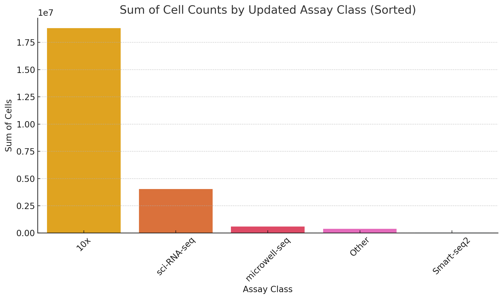
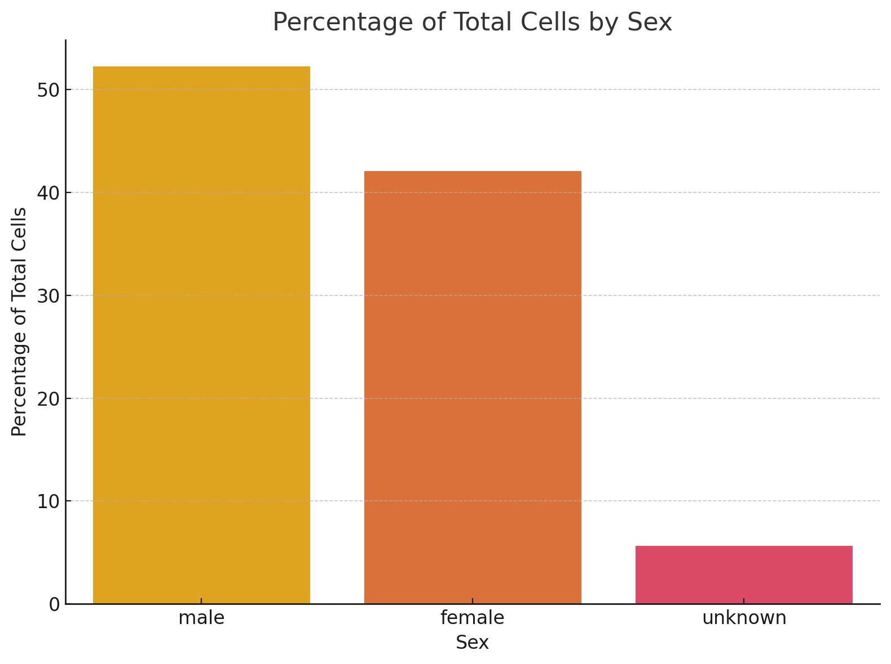
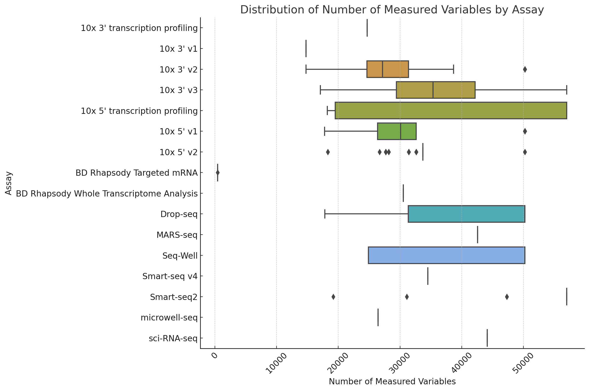

# CELLxGENE

## Description
[CELLxGENE](https://cellxgene.cziscience.com/) is an aggregation of publicly available single-cell datasets collected by CZI.

## Dataset attributes of version 2023-12-15
Data was downloaded using the [CELLxGENE Discover Census version `2023-12-15`](https://chanzuckerberg.github.io/cellxgene-census/cellxgene_census_docsite_data_release_info.html#lts-2023-12-15). We first downloaded cellxgene census version 2023-12-15 using the `cellxgene_census` python API. We limited cell data to `organism=”Homo sapiens”`, with a non “na” `suspension_type`, `is_primary_data=True`, and `disease=”normal”` to limit to non-diseased tissues that are also the primary data source per cell to make sure that cells are only included once in the download. We tracked metadata including “assay”, “sex”, “development_stage”, “tissue_general”, “dataset_id” and “self_reported_ethnicity”. The metadata “assay”, “tissue_general”, and “dataset_id” were used to construct dataset splits into train, validation, and test sets. The training set represented 99% of the downloaded cells. We partitioned the data by dataset_id into a train set (99%) and a hold-out set (1%), to make sure that the hold-out datasets were independently collected single cell experiments, which helps evaluate generalizability to new future datasets. In this training split, we made sure that all “assay” and “tissue_general” labels were present in the training set so that our model would have maximal visibility into different tissues and assay biases. Finally the 1% hold-out set was split further into a validation and test set. This final split was mostly done randomly by cell, however we set aside a full dataset into the test split so that we could evaluate performance after training on a completely unseen dataset, including when monitoring the validation loss during training.

These parameters resulted in 23.87 Million single cells collected from a variety of public datasets, all hosted by CZI cell x gene census. After the splitting procedure we had:
* 23.64 Million cells in the training split
* 0.13 Million cells in the validation split
* 0.11 Million cells in the test split

### Distributions of donor covariates
There are various biases apparent in this dataset.

#### Tissue distribution
At a high level tissues were heavily biased toward the nervous system, which made up nearly 40 percent of the data.

#### Assay distribution
Assays were also imbalanced in this dataset. As the 10x machine is fairly high throughput and currently popular, it makes sense that the majority of cells present would be from this instrument. Various versions of the 10x instrument made up 18M of the 24M cells while the next largest category was `sci-RNA-seq`.

#### Sex distribution
A bias exists in this dataset for sex. Most of the donor's cells were male-derived at 52%, while female donor's cell contribution made up 42%, and the remaining 6% were not annotated.
.

#### Reported ethnicity distribution
The dataset has a heavy bias toward cells derived from donors with european ethnicity at 40%, while the next largest category, asian, made up 8%. When considering that nearly 50% were unknown, we might expect that as much as 75% of this dataset is made up of cells extracted from donors of self reported european ethnicity.

#### Age distribution
This dataset is very heavily balanced toward younger donors. Many of the cells are derived from donors that are under a year of age (over 25%). After that the remaining 75% of cells are dispersed roughly under a normal distribution with a mode of 51-60 other than an additional peak in the 21-30 range. Donors over 61 years old make up approximately 15% of the data.

#### Assay size distribution
Different assays have different ranges of reported gene measurements. On the low end `BD Rapsody Targetted mRNA` has only a few genes reported, while 10x instruments tend to report on 30,000 genes.

#### Dataset distribution
Dataset (eg a publication that produces data and uploads to cellxgene) leads to known batch effects due to different handling proceedures, collection procedures, etc. We stratify our training vs hold-out split by this covariate for this reason. Exploring the breakdown of datasets we see that the top 10 datsets represent approximately 10 million cells of the full cellxgene datset. The largest dataset alone has 4 million cells.

Looking at the makeup of these top datasets, we see that most represent single tissue categories predominately. Most of these tend to be nervous system datsets with the exception of one which is balanced between many cell types.

## References
* [CZ CELLxGENE Discover](https://doi.org/10.1101/2023.10.30.563174): A single-cell data platform for scalable exploration, analysis and modeling of aggregated data CZI Single-Cell Biology, et al. bioRxiv 2023.10.30; doi: https://doi.org/10.1101/2023.10.30.563174

## Data License
The data in [CELLxGENE](https://cellxgene.cziscience.com/) are made available by the study authors and [Chan Zuckerberg Initiative](https://cziscience.com/) under the creative commons [CC BY 4.0](https://creativecommons.org/licenses/by/4.0/) license. Study authors agree prior to submission that their data is not identifiable, lacking any direct personal identifiers in the metadata. More information may be found in the [CELLxGENE Data Submission Policy](https://cellxgene.cziscience.com/docs/032__Contribute%20and%20Publish%20Data).
Our training, validation and test data, including subsets made available for testing and demonstration purposes, was contributed to CELLxGENE through one or more of the following sources:

* A Web Portal and Workbench for Biological Dissection of Single Cell COVID-19 Host Responses. <https://doi.org/10.1016/j.isci.2021.103115>
* A blood atlas of COVID-19 defines hallmarks of disease severity and specificity. <https://doi.org/10.1016/j.cell.2022.01.012>
* A cell atlas of human thymic development defines T cell repertoire formation. <https://doi.org/10.1126/science.aay3224>
* A human breast atlas integrating single-cell proteomics and transcriptomics. <https://doi.org/10.1016/j.devcel.2022.05.003>
* A human cell atlas of fetal gene expression. <https://doi.org/10.1126/science.aba7721>
* A human fetal lung cell atlas uncovers proximal-distal gradients of differentiation and key regulators of epithelial fates. <https://doi.org/10.1016/j.cell.2022.11.005>
* A molecular atlas of the human postmenopausal fallopian tube and ovary from single-cell RNA and ATAC sequencing. <https://doi.org/10.1016/j.celrep.2022.111838>
* A molecular cell atlas of the human lung from single cell RNA sequencing. <https://doi.org/10.1038/s41586-020-2922-4>
* A molecular single-cell lung atlas of lethal COVID-19. <https://doi.org/10.1038/s41586-021-03569-1>
* A proximal-to-distal survey of healthy adult human small intestine and colon epithelium by single-cell transcriptomics. <https://doi.org/10.1016/j.jcmgh.2022.02.007>
* A single-cell atlas of the healthy breast tissues reveals clinically relevant clusters of breast epithelial cells. <https://doi.org/10.1016/j.xcrm.2021.100219>
* A single-cell transcriptional roadmap of the mouse and human lymph node lymphatic vasculature. <https://doi.org/10.3389/fcvm.2020.00052>
* A single-cell transcriptome atlas of the adult human retina. <https://doi.org/10.15252/embj.2018100811>
* A spatially resolved single cell genomic atlas of the adult human breast. <https://doi.org/10.1038/s41586-023-06252-9>
* A transcriptional cross species map of pancreatic islet cells. <https://doi.org/10.1016/j.molmet.2022.101595>
* Abdominal White Adipose Tissue. <https://doi.org/>
* Acute COVID-19 cohort across a range of WHO categories seen at the Department of Emergency Medicine at MGH. <https://doi.org/10.1101/2020.11.20.20227355>
* An Integrated Single Cell Meta-atlas of Human Periodontitis. <https://doi.org/10.1101/2023.08.23.554343>
* An atlas of healthy and injured cell states and niches in the human kidney. <https://doi.org/10.1038/s41586-023-05769-3>
* Asian Immune Diversity Atlas (AIDA). <https://doi.org/>
* Blood and immune development in human fetal bone marrow and Down syndrome. <https://doi.org/10.1038/s41586-021-03929-x>
* Brain matters: Unveiling the Distinct Contributions of Region, Age, and Sex to Glia diversity and CNS Function. <https://doi.org/10.1186/s40478-023-01568-z>
* COVID-19 immune features revealed by a large-scale single-cell transcriptome atlas. <https://doi.org/10.1016/j.cell.2021.01.053>
* Cell Atlas of The Human Fovea and Peripheral Retina. <https://doi.org/10.1038/s41598-020-66092-9>
* Cell Types of the Human Retina and Its Organoids at Single-Cell Resolution. <https://doi.org/10.1016/j.cell.2020.08.013>
* Cell atlas of the human ocular anterior segment: Tissue-specific and shared cell types. <https://doi.org/10.1073/pnas.2200914119>
* Cells of the adult human heart. <https://doi.org/10.1038/s41586-020-2797-4>
* Cells of the human intestinal tract mapped across space and time. <https://doi.org/10.1038/s41586-021-03852-1>
* Cellular heterogeneity of human fallopian tubes in normal and hydrosalpinx disease states identified by scRNA-seq. <https://doi.org/10.1101/2021.09.16.460628>
* Charting human development using a multi-endodermal organ atlas and organoid models. <https://doi.org/10.1016/j.cell.2021.04.028>
* Construction of a human cell landscape at single-cell level. <https://doi.org/10.1038/s41586-020-2157-4>
* Cross-tissue immune cell analysis reveals tissue-specific features in humans. <https://doi.org/10.1126/science.abl5197>
* Differential cell composition and split epidermal differentiation in human palm, sole, and hip skin. <https://doi.org/10.1016/j.celrep.2023.111994>
* Distinct microbial and immune niches of the human colon. <https://doi.org/10.1038/s41590-020-0602-z>
* Early role for a Na+,K+-ATPase (ATP1A3) in brain development. <https://doi.org/10.1073/pnas.2023333118>
* Emphysema Cell Atlas. <https://doi.org/10.1016/j.immuni.2023.01.032>
* HCA kidney seed network: University of Michigan. <https://doi.org/>
* HTAN MSK - Single cell profiling reveals novel tumor and myeloid subpopulations in small cell lung cancer. <https://doi.org/10.1016/j.ccell.2021.09.008>
* High-resolution single-cell atlas reveals diversity and plasticity of tumor-associated neutrophils in non-small cell lung cancer. <https://doi.org/10.1016/j.ccell.2022.10.008>
* Human Brain Cell Atlas v1.0. <https://doi.org/10.1126/science.add7046>
* Human breast cell atlas. <https://doi.org/10.1101/2023.04.21.537845>
* Human developing neocortex by area. <https://doi.org/10.1038/s41586-021-03910-8>
* Identification of distinct tumor cell populations and key genetic mechanisms through single cell sequencing in hepatoblastoma. <https://doi.org/10.1038/s42003-021-02562-8>
* Immunophenotyping of COVID-19 and influenza highlights the role of type I interferons in development of severe COVID-19. <https://doi.org/10.1126/sciimmunol.abd1554>
* Insulin is expressed by enteroendocrine cells during human fetal development. <https://doi.org/10.1038/s41591-021-01586-1>
* Integrated adult and foetal heart single-cell RNA sequencing. <https://doi.org/10.1038/s44161-022-00183-w>
* Integrated analysis of multimodal single-cell data. <https://doi.org/10.1016/j.cell.2021.04.048>
* Integrated scRNA-Seq Identifies Human Postnatal Thymus Seeding Progenitors and Regulatory Dynamics of Differentiating Immature Thymocytes. <https://doi.org/10.1016/j.immuni.2020.03.019>
* Integration of eQTL and a Single-Cell Atlas in the Human Eye Identifies Causal Genes for Age-Related Macular Degeneration. <https://doi.org/10.1016/j.celrep.2019.12.082>
* Intra- and Inter-cellular Rewiring of the Human Colon during Ulcerative Colitis. <https://doi.org/10.1016/j.cell.2019.06.029>
* Intratumoral heterogeneity in recurrent pediatric pilocytic astrocytomas. <https://doi.org/>
* Local and systemic responses to SARS-CoV-2 infection in children and adults. <https://doi.org/10.1038/s41586-021-04345-x>
* LungMAP — Human data from a broad age healthy donor group. <https://doi.org/10.7554/eLife.62522>
* Mapping single-cell transcriptomes in the intra-tumoral and associated territories of kidney cancer. <https://doi.org/10.1016/j.ccell.2022.11.001>
* Mapping the developing human immune system across organs. <https://doi.org/10.1126/science.abo0510>
* Mapping the temporal and spatial dynamics of the human endometrium in vivo and in vitro. <https://doi.org/10.1038/s41588-021-00972-2>
* Multimodal single cell sequencing implicates chromatin accessibility and genetic background in diabetic kidney disease progression. <https://doi.org/10.1038/s41467-022-32972-z>
* Multiomics single-cell analysis of human pancreatic islets reveals novel cellular states in health and type 1 diabetes. <https://doi.org/10.1038/s42255-022-00531-x>
* Pathogenic variants damage cell composition and single cell transcription in cardiomyopathies. <https://doi.org/10.1126/science.abo1984>
* SARS-CoV-2 receptor ACE2 and TMPRSS2 are primarily expressed in bronchial transient secretory cells. <https://doi.org/10.15252/embj.20105114>
* SEA-AD: Seattle Alzheimer’s Disease Brain Cell Atlas. <https://doi.org/10.1101/2023.05.08.539485>
* Single cell RNA sequencing of bone marrow mononuclear cells from healthy donors and B-cell lymphoma patients following CD19 CAR T-cell therapy. <https://doi.org/10.1016/j.xcrm.2023.101158>
* Single cell RNA sequencing of follicular lymphoma. <https://doi.org/10.1158/2643-3230.BCD-21-0075>
* Single cell RNA sequencing of human liver reveals distinct intrahepatic macrophage populations. <https://doi.org/10.1038/s41467-018-06318-7>
* Single cell analysis of mouse and human prostate reveals novel fibroblasts with specialized distribution and microenvironment interactions. <https://doi.org/10.1002/path.5751>
* Single cell dissection of plasma cell heterogeneity in symptomatic and asymptomatic myeloma. <https://doi.org/10.1038/s41591-018-0269-2>
* Single cell transcriptional and chromatin accessibility profiling redefine cellular heterogeneity in the adult human kidney. <https://doi.org/10.1038/s41467-021-22368-w>
* Single-Cell Sequencing of Developing Human Gut Reveals Transcriptional Links to Childhood Crohn’s Disease. <https://doi.org/10.1016/j.devcel.2020.11.010>
* Single-Cell, Single-Nucleus, and Spatial RNA Sequencing of the Human Liver Identifies Cholangiocyte and Mesenchymal Heterogeneity. <https://doi.org/10.1002/hep4.1854>
* Single-cell Atlas of common variable immunodeficiency shows germinal center-associated epigenetic dysregulation in B-cell responses. <https://doi.org/10.1038/s41467-022-29450-x>
* Single-cell RNA sequencing unifies developmental programs of Esophageal and Gastric Intestinal Metaplasia. <https://doi.org/10.1158/2159-8290.cd-22-0824>
* Single-cell RNA-seq reveals the cell-type-specific molecular and genetic associations to lupus. <https://doi.org/10.1126/science.abf1970>
* Single-cell analyses of renal cell cancers reveal insights into tumor microenvironment, cell of origin, and therapy response. <https://doi.org/10.1073/pnas.2103240118>
* Single-cell analysis of human B cell maturation predicts how antibody class switching shapes selection dynamics. <https://doi.org/10.1126/sciimmunol.abe6291>
* Single-cell analysis of prenatal and postnatal human cortical development. <https://doi.org/10.1126/science.adf0834>
* Single-cell atlas of peripheral immune response to SARS-CoV-2 infection. <https://doi.org/10.1038/s41591-020-0944-y>
* Single-cell eQTL mapping identifies cell type specific genetic control of autoimmune disease. <https://doi.org/10.1126/science.abf3041>
* Single-cell genomic profiling of human dopamine neurons identifies a population that selectively degenerates in Parkinson’s disease. <https://doi.org/10.1038/s41593-022-01061-1>
* Single-cell multi-omics analysis of the immune response in COVID-19. <https://doi.org/10.1038/s41591-021-01329-2>
* Single-cell proteo-genomic reference maps of the hematopoietic system enable the purification and massive profiling of precisely defined cell states. <https://doi.org/10.1038/s41590-021-01059-0>
* Single-cell reconstruction of follicular remodeling in the human adult ovary. <https://doi.org/10.1038/s41467-019-11036-9>
* Single-cell reconstruction of the early maternal–fetal interface in humans. <https://doi.org/10.1038/s41586-018-0698-6>
* Single-cell roadmap of human gonadal development. <https://doi.org/10.1038/s41586-022-04918-4>
* Single-cell transcriptomes of the human skin reveal age-related loss of fibroblast priming. <https://doi.org/10.1038/s42003-020-0922-4>
* Single-cell transcriptomic atlas for adult human retina. <https://doi.org/10.1016/j.xgen.2023.100298>
* Single-cell transcriptomic atlas of the human retina identifies cell types associated with age-related macular degeneration. <https://doi.org/10.1038/s41467-019-12780-8>
* Single-cell transcriptomics of human T cells reveals tissue and activation signatures in health and disease. <https://doi.org/10.1038/s41467-019-12464-3>
* Single-nucleus cross-tissue molecular reference maps to decipher disease gene function. <https://doi.org/10.1126/science.abl4290>
* Single-soma transcriptomics of tangle-bearing neurons in Alzheimer’s disease. <https://doi.org/10.1016/j.neuron.2022.06.021>
* Spatial multi-omic map of human myocardial infarction. <https://doi.org/10.1038/s41586-022-05060-x>
* Spatial multiomics map of trophoblast development in early pregnancy. <https://doi.org/10.1038/s41586-023-05869-0>
* Spatial proteogenomics reveals distinct and evolutionarily conserved hepatic macrophage niches. <https://doi.org/10.1016/j.cell.2021.12.018>
* Spatially resolved multiomics of human cardiac niches. <https://doi.org/10.1038/s41586-023-06311-1>
* Spatiotemporal analysis of human intestinal development at single-cell resolution. <https://doi.org/10.1016/j.cell.2020.12.016>
* Spatiotemporal immune zonation of the human kidney. <https://doi.org/10.1126/science.aat5031>
* Stress-induced RNA–chromatin interactions promote endothelial dysfunction. <https://doi.org/10.1038/s41467-020-18957-w>
* Tabula Sapiens. <https://doi.org/10.1126/science.abl4896>
* The integrated Human Lung Cell Atlas. <https://doi.org/10.1038/s41591-023-02327-2>
* The landscape of immune dysregulation in Crohn’s disease revealed through single-cell transcriptomic profiling in the ileum and colon. <https://doi.org/10.1016/j.immuni.2023.01.002>
* Time-resolved Systems Immunology Reveals a Late Juncture Linked to Fatal COVID-19. <https://doi.org/10.1016/j.cell.2021.02.018>
* Transcriptional Programming of Normal and Inflamed Human Epidermis at Single-Cell Resolution. <https://doi.org/10.1016/j.celrep.2018.09.006>
* Transcriptomic cytoarchitecture reveals principles of human neocortex organization. <https://doi.org/10.1126/science.adf6812>
* Type I interferon autoantibodies are associated with systemic immune alterations in patients with COVID-19. <https://doi.org/10.1126/scitranslmed.abh2624>
* scRNA-seq assessment of the human lung, spleen, and esophagus tissue stability after cold preservation. <https://doi.org/10.1186/s13059-019-1906-x>
