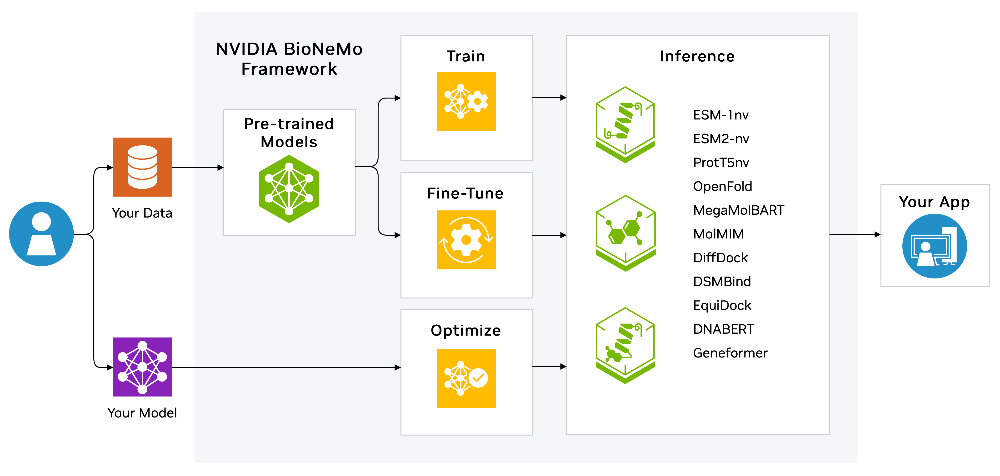

# Introduction

AI models are changing how we think about and access information on an unprecedented scale. These methods, ranging from regression, classification, and even generation, allow the exploration of data-driven domains in unique ways. A model can be trained to identify groups of pixels sorted and categorized for animals or identify abnormal cell growths in medical image slices. Large language models (LLMs) have shown their ability to contextualize long-range information of letter sequences and act as knowledge agents of written language for movie recommendations or prescribe patient care needs to physicians. Beyond these types of models, an increasingly complex toolbox can be used in tandem to solve new and challenging problems in the biomolecular space. 

A key and familiar paradigm in Biology exists that "<b>Structure</b> determines <b>Function</b>." By proxy, the <b>Structure</b> of a biomolecular object is determined by its respective molecule or protein <b>Sequence</b>.

$$\ce{Sequence -> Structure -> Function}$$

$$ \ce{Sequence -> Function}$$

Critical for antibody therapeutics research is the measure of its stability, which in turn affects properties like specificity and affinity. Determining the thermostability of an antibody requires expressing or synthesizing the antibody, followed by time consuming and costly experimental measurements. This highlights the need for rapid pipelines that connect the antibody protein sequence's coherent relationship to its thermostability. Specifically, a protein LLM (pLM) can be used to obtain a learned representation of the protein sequence, which can then be used to fit a downstream model for predicting thermostability. Once the thermostability of a generated protein sequence has been determined, a secondary question can be asked about antibody interactions with other biomolecules.

Biomolecular large language models (LLMs) are achieving incredible breakthroughs in chemistry and biology, such as enabling 3D protein structure prediction, property prediction, and even the generation of novel protein sequences and molecules. This progress has facilitated developments in the pharmaceutical industry, such as antibody design, small-molecule drug design, and newer approaches like RNA aptamer and peptide-based therapeutics. As each of these pieces comes into play, their respective models may need additional fine-tuning or optimization to thoroughly explore or understand the biomolecular space, leading to the need for centralized workflows and infrastructure to capture the <b>Sequence</b> to <b>Function</b> pipeline. 

BioNeMo seeks to serve as a platform for accessibility to multiple bio-related AI tools to serve researchers in their challenges. The BioNeMo framework facilitates centralized model training, optimization, fine-tuning, and inferencing for protein and molecular design.

## BioNeMo Framework
BioNeMo Framework provides versatile functionalities for developing, training and deploying large language models. BioNeMo allows users to build biomolecular LLMs by providing access to pre-trained models, creating workflows to fit downstream task models from LLM embeddings, and generating biomolecules that meet user-specified criteria based on the fit model. Built for supercomputing scale, the framework allows developers to easily configure and deploy distributed multi-node jobs with minimal code. 

The underpinnings of the biological research framework rely on [NeMo](https://docs.nvidia.com/deeplearning/nemo/user-guide/docs/en/stable/starthere/intro.html), a framework initially established for conversational AI methods. NeMo provides a robust environment for working with large learning models, including [Megatron](https://docs.nvidia.com/deeplearning/nemo/user-guide/docs/en/stable/nlp/megatron.html) models. The BioNeMo Framework provides enhancements to PyTorch Lighting, such as hyperparameter configuarbility with YAML files and checkpoint management. Users can conveniently and quickly train an LLM using these features, test them for desired tasks, and integrate them alongside existing applications. 

Some of the key features of BioNeMo Framework are:

* Development and training of large transformer models using NVIDIA's Megatron framework.
* Easy to configure multi-GPU, multi-node training with data parallelism, model parallelism, and mixed precision.
* Model training recipes that can be readily implemented on DGX compute infrastructure.
* Logging with Tensorboard and Weights and Biases to monitor the model training process.

<iframe width="560" height="315" src="https://www.youtube.com/embed/en2Vl6u-umk" title="Training BioMolecular Models on BioNeMo" frameborder="0" allow="accelerometer; autoplay; clipboard-write; encrypted-media; gyroscope; picture-in-picture; web-share" allowfullscreen></iframe>

## Prerequisites

Before you begin using BioNeMo, ensure the following prerequisites are met:

1. Access to [BioNeMo Framework](https://www.nvidia.com/en-us/gpu-cloud/bionemo/) from NVIDIA.
2. Access to NVIDIA DGX compute infrastructure ([DGX-Cloud](https://www.nvidia.com/en-us/data-center/dgx-cloud/) or [DGX-Pod](https://www.nvidia.com/en-us/data-center/dgx-basepod/)).

## BioNeMo Models: Overview

BioNeMo Framework provides three pre-trained models developed by NVIDIA: __**ESM1-nv**__, __**ProtT5-nv**__, and __**MegaMolBART**__. It additionally provides NeMo optimized checkpoints for ESM2 models, as __**ESM2-nv**__. These models can perform representation learning and sequence translation tasks on amino acid sequences and small molecule (SMILES) representations. Molecule generation can also be performed using MegaMolBART.

| **Model**   | **Modality**             | **Uses**                                      |
|-------------|--------------------------|-----------------------------------------------|
| ESM-2nv     | Protein                  | Representation Learning                       |
| ESM-1nv     | Protein                  | Representation Learning                       |
| ProtT5nv    | Protein                  | Representation Learning                       |
| MegaMolBART | Small Molecule           | Representation Learning + Molecule Generation |

**ESM-2nv** and **ESM-1nv** are based on the BERT architecture and trained on millions of protein sequences from the UniProt database. They learn a numerical representation based on the amino acids. These representations can be used to predict properties, such as subcellular localization, thermostability, and solubility, as well as higher order structure, including secondary and tertiary structure.

**ProtT5nv** is based on the T5 architecture and trained on millions of protein sequences from the UniProt database. Like ESM-1nv, Prot5nv learns a representation for amino acids, allowing it to represent a variety of protein properties, similar to ESM-1nv.

**MegaMolBART** is based on the BART architecture and trained on billions of SMILES from the ZINC15 database. MegaMolBART understands chemistry and is capable of producing embeddings that can be used for prediction of chemical properties and performing sequence translation tasks such as retrosynthesis prediction. Because MegaMolBART utilizes an autoregressive decoder, it can also generate molecules starting from a seed molecule.

For more information about the models included in BioNeMo Framework, refer to the [Model Details section](./models/esm1-nv.md) or the original publications, referenced in the respective model descriptions.

Refer to the [Quickstart Guide](./quickstart-fw.md) for details on how to get started with BioNeMo Framework.

## Accessing BioNeMo

To access NVIDIA BioNeMo Framework, visit the {{bionemo_info_url}}.
