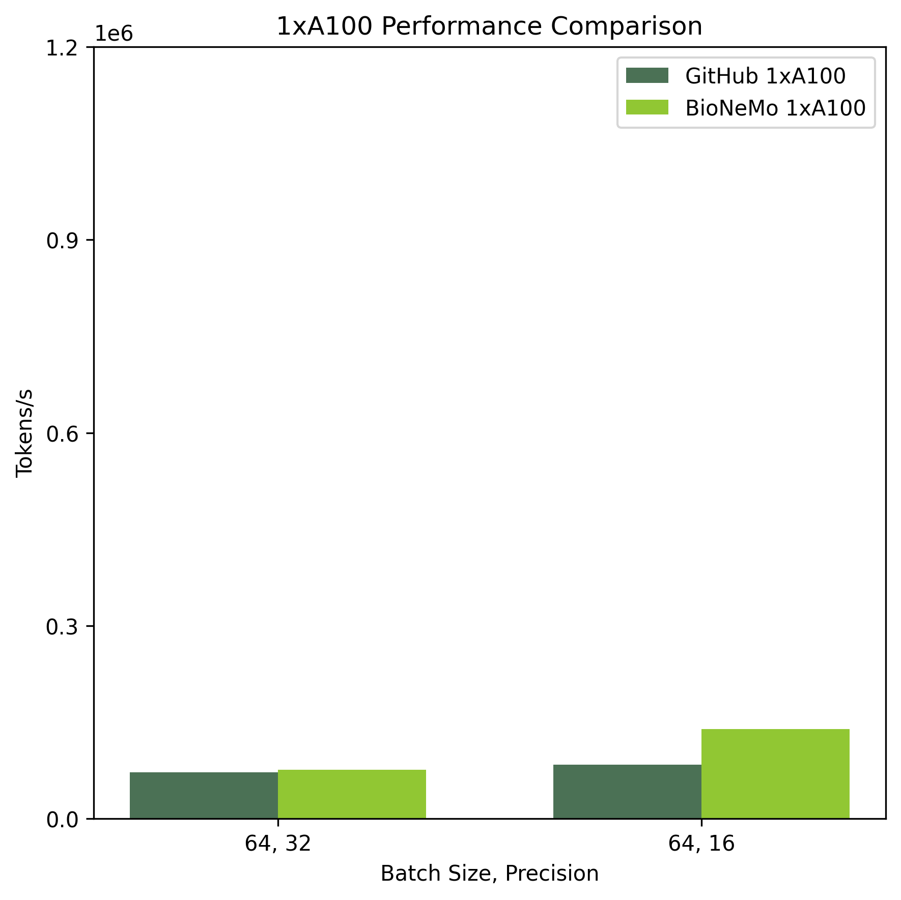
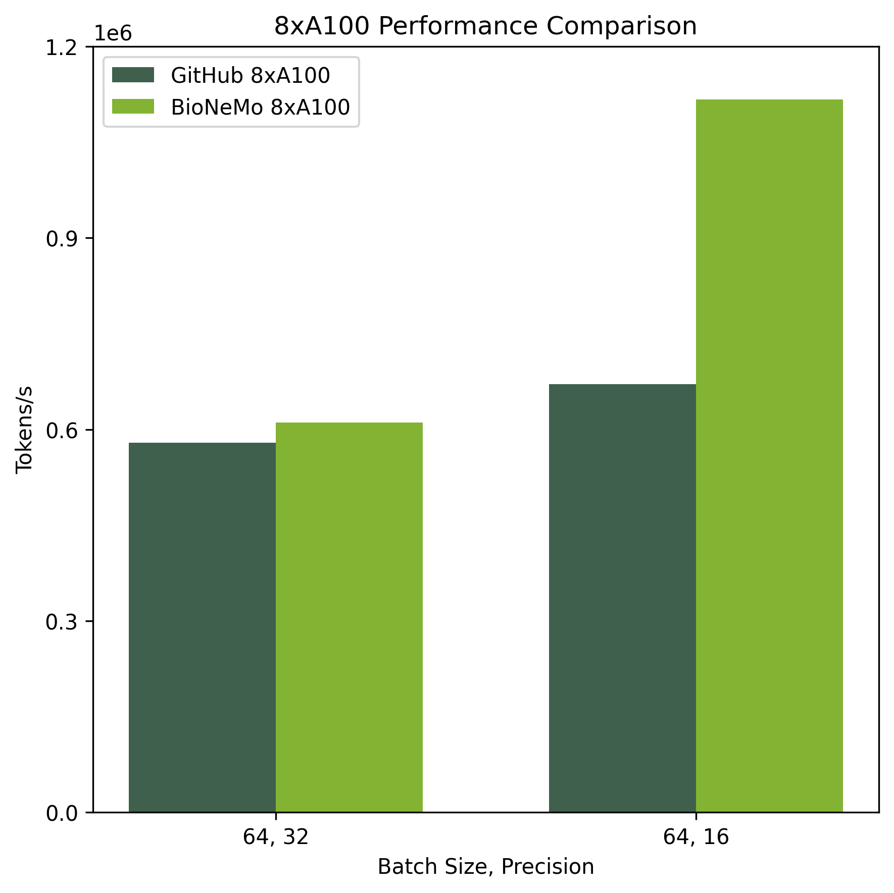

# DNABERT
# Model Overview

## Description:

DNABERT generates a dense representation of a genome sequence by identifying contextually similar sequences in the human genome. DNABert is a DNA sequence model trained on sequences from the human reference genome Hg38.p13. DNABERT computes embeddings for each nucleotide in the input sequence. The embeddings are used as features for a variety of predictive tasks. This model is ready for both commercial and non-commercial use.

## References:
First masked language model approach for genomics: Gene2vec: distributed representation of genes based on co-expression | BMC Genomics | Full Text (biomedcentral.com)

DNABERT: DNABERT: pre-trained Bidirectional Encoder Representations from Transformers model for DNA-language in genome | bioRxiv

The Nucleotide Transformer: The Nucleotide Transformer: Building and Evaluating Robust Foundation Models for Human Genomics | bioRxiv

Big-Bird: [2007.14062] Big Bird: Transformers for Longer Sequences (arxiv.org)

DNABERT-2: [2306.15006] DNABERT-2: Efficient Foundation Model and Benchmark For Multi-Species Genome (arxiv.org)

## Model Architecture: 
**Architecture Type:** BERT   
**Network Architecture:** DNABERT  

## Input: (Enter "None" As Needed)
**Input Type(s):** Plain Text of nucleotide sequences (A, C, G, T).  
**Input Format(s):** Fasta Format t 
**Input Parameters:** 1D  

## Output: (Enter "None" As Needed)
**Output Type(s):** Text predictions in the form of dense numerical embeddings.  

**Output Parameters:** 1D  
**Other Properties Related to Output:** Numeric vector with one float-point value corresponding to each amino acid in the input protein sequence   

## Software Integration:
**Runtime Engine(s):** 
* BioNeMo, NeMo  

**Supported Hardware Microarchitecture Compatibility:**  
* [Ampere]  
* [Hopper]  
* [Volta]  

**[Preferred/Supported] Operating System(s):**  
* [Linux]  

## Model Version(s): 
dnabert-86M.nemo, version 1.0   

# Training & Evaluation: 

## Training Dataset:
**Link:** Homo sapiens genome assembly GRCh38.p13 - NCBI - NLM (nih.gov)  
** Data Collection Method by dataset  
* [Human]  
** Labeling Method by dataset  
* [Not Applicable]  

**Properties:** 3.2 Billion nucleotides of the human genome sequence..  

**Dataset License(s):** N/A, no license for human genome  

## Evaluation Dataset:
**Link:** Ensembl release 99 http://ftp.ensembl.org/pub/release-99/gff3/homo_sapiens/  
**Data Collection Method by dataset**  
* [Human]  
**Labeling Method by dataset**  
* [Hybrid: Automated, Human review]  
**Properties:** There are ~80,000 unique gene isoforms with a varying amount of exons and thus spice sites. 30,000 splice-sites with full gene annotations are sampled for evaluation. Genes, or gene bodies, are the genomic body in which RNA transcripts are produced. This is a sequence of nucleotides. Within this gene body, there are constructs known as exons- non-contiguous chunks of DNA that are concatenated by cellular machinery into a complete RNA, known as a transcript. A specific arrangement of exons are known as an ‘isoform.’ Splice-sites are nucleotide sites within the gene body that are junctions, where transcription starts and ends for different exons where exons are ‘spliced’ from the gene body into a RNA sequence.  
**Dataset License(s):** Apache 2.0  

## Inference:
**Engine:** BioNeMo, NeMo  
**Test Hardware:**  
* [Ampere]  
* [Hopper]  
* [Volta]   

## Accuracy Benchmarks

To evaluate our implementation of DNABERT, we pre-trained the model for 400,000 steps with a minibatch size of 128, which is approximately equal to the number of samples used to pre-train the original publication. The model resulted in 86 million parameters. We next fine-tuned the model on the splice-site prediction task using the Ensembl GRCh38.p13 version 99 annotations. 10,000 donor sites, 10,000 acceptor sites, and 10,000 random negative sites (from gene bodies) were sampled and split into train (80%), validation (10%), and testing (10%). We then evaluated performance by measuring the f1_score, accuracy, and Matthews correlation coefficient (MCC). In accordinace with the original publication, we compute a confusion matrix for donors and acceptors separately, and then took the mean of each metric. In the case that a donor was predicted to be an acceptor, or an acceptor was predicted to be a donor, we labeled these as false positives.

| Metric           | Value               |
|------------------|---------------------|
| donor_accuracy   | 0.9491  |
| acceptor_accuracy| 0.9345  |
| donor_mcc        | 0.8982  |
| acceptor_mcc     | 0.8691  |
| donor_f1         | 0.9502  |
| acceptor_f1      | 0.9361  |

**Average Scores**

| Metric        | Value               |
|---------------|---------------------|
| avg_accuracy  | 0.9418  |
| avg_mcc       | 0.8837  |
| avg_f1        | 0.9432  |

## Performance Benchmarks
Training performance benchmarks were performed on systems with 1xA100 80GB and 8xA100 80GB. Performance was compared against the reference pre-training code provided in the DNABERT github repository (https://github.com/jerryji1993/DNABERT).

## Ethical Considerations:
NVIDIA believes Trustworthy AI is a shared responsibility and we have established policies and practices to enable development for a wide array of AI applications.  When downloaded or used in accordance with our terms of service, developers should work with their supporting model team to ensure this model meets requirements for the relevant industry and use case and addresses unforeseen product misuse.  For more detailed information on ethical considerations for this model, please see the Model Card++ Explainability, Bias, Safety & Security, and Privacy Subcards [Insert Link to Model Card++ here].  Please report security vulnerabilities or NVIDIA AI Concerns [here](https://www.nvidia.com/en-us/support/submit-security-vulnerability/).
