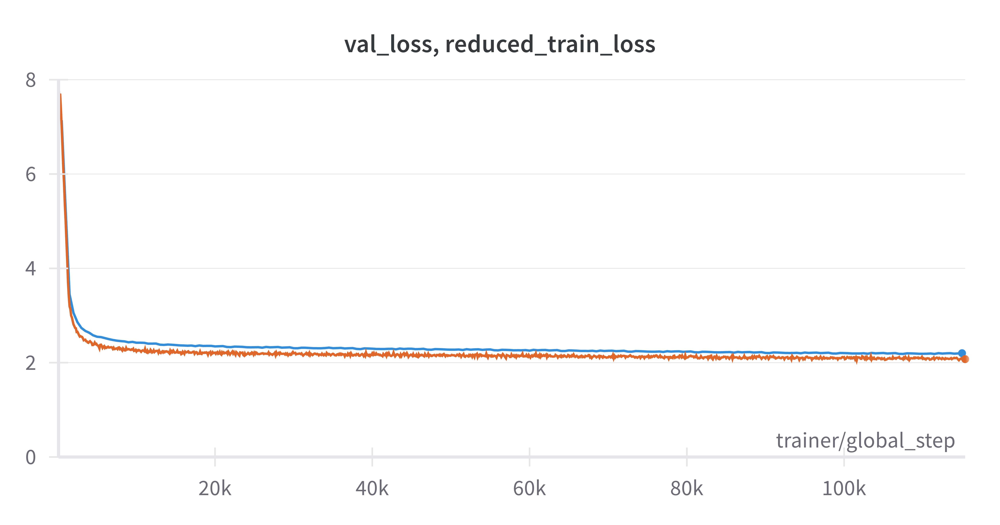
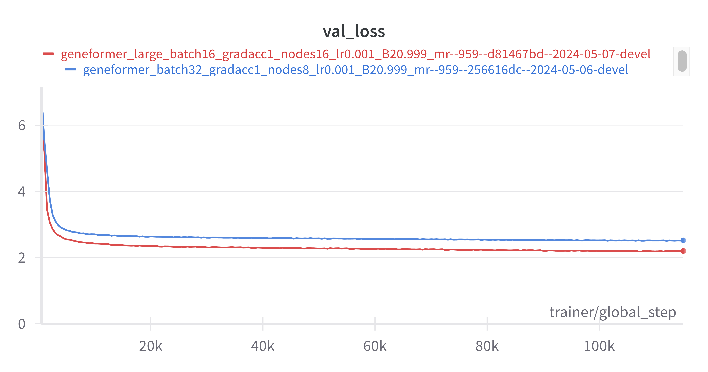

# sc-FM
## Model Overview

### Description:

sc-FM generates a dense representation of a sc-RNA cell by learning co-expression patterns within single cells. sc-FM is a tabular count model trained on sc-RNA from the Chan Zuckerberg Cell x Gene census. sc-FM computes a complete embedding for each cell over the top 1024 expressed genes. The embeddings are used as features for a variety of predictive tasks. This model is ready for both commercial use.

### References:
* Geneformer, reference foundation model for single-cell RNA: Transfer learning enables predictions in network biology | Nature
* scGPT, alternative foundation model for single-cell RNA: scGPT: toward building a foundation model for single-cell multi-omics using generative AI | Nature Methods
* scBERT, alternative foundation model for single-cell RNA: scBERT as a large-scale pretrained deep language model for cell type annotation of single-cell RNA-seq data | Nature Machine Intelligence
* scFoundation, alternative foundation model for single-cell RNA: Large Scale Foundation Model on Single-cell Transcriptomics | bioRxiv
Cell x Gene census, public repository for sc-RNA experiments: CZ CELLxGENE Discover - Cellular Visualization Tool (cziscience.com)

### Model Architecture: 
**Architecture Type:** Bidirectional Encoder Representations from Transformers (BERT)   
**Network Architecture:** Geneformer  

### Input: 
**Input Type(s):** Number (Row represents cell, containing gene names and single cell expression counts)  
**Input Format(s):**  Array AnnData 
**Input Parameters:** 1D  

### Output:
**Output Type(s):** Vector (Dense Embedding Predictions)embeddings.  
**Output Format:** NumPy  
**Output Parameters:** 1D  
**Other Properties Related to Output:** Numeric floating point vector (fp 16 or fp32)   

### Software Integration:
**Runtime Engine(s):** 
* BioNeMo, NeMo 1.2  

**Supported Hardware Microarchitecture Compatibility:**  
* Ampere  
* Hopper  
* Volta  

**[Preferred/Supported] Operating System(s):**  
* Linux  

### Model Version(s): 
* geneformer-10M-240530   
    * 10.3M parameter geneformer variant. 
    * 25429 ensemble ID based gene tokens
    * 256 hidden dimensions with 4 heads, 6 layers and an 512 dimensional FFN
    * relu activation
    * 1e-12 EPS layernorm
    * bf16 mixed precision training with 32 bit residual connections
    * 2% hidden dropout, 10% attention dropout
* geneformer-106M-240530
    * 106M parameter geneformer variant. 
    * 25429 ensemble ID based gene tokens
    * 768 hidden dimensions with 12 heads, 12 layers and an 3072 dimensional FFN
    * relu activation
    * 1e-12 EPS layernorm
    * bf16 mixed precision training with 32 bit residual connections
    * 2% hidden dropout, 10% attention dropout

## Training & Evaluation: 

### Training Dataset:
CELLxGENE census was used for the direct download of data matching similar criteria to those described in the geneformer publication. We first downloaded cellxgene census version 2023-12-15 using the cellxgene_census python API. We limited cell data to organism=”Homo sapiens”, with a non “na” suspension_type, is_primary_data=True, and disease=”normal” to limit to non-diseased tissues that are also the primary data source per cell to make sure that cells are only included once in the download. We tracked metadata including “assay”, “sex”, “development_stage”, “tissue_general”, “dataset_id” and “self_reported_ethnicity”. The metadata “assay”, “tissue_general”, and “dataset_id” were used to construct dataset splits into train, validation, and test sets. The training set represented 99% of the downloaded cells. We partitioned the data by dataset_id into a train set (99%) and a hold-out set (1%), to make sure that the hold-out datasets were independently collected single cell experiments, which helps evaluate generalizability to new future datasets. In this training split, we made sure that all “assay” and “tissue_general” labels were present in the training set so that our model would have maximal visibility into different tissues and assay biases. Finally the 1% hold-out set was split further into a validation and test set. This final split was mostly done randomly by cell, however we set aside a full dataset into the test split so that we could evaluate performance after training on a completely unseen dataset, including when monitoring the validation loss during training.

**Link:** Datasets downloaded from CZ CELLxGENE Discover - Cellular Visualization Tool (cziscience.com)  
** Data Collection Method by dataset  
* [Human]  

**Properties (Quantity, Dataset Descriptions, Sensor(s)):**  
23.876 Million single cells collected from a variety of public datasets, all hosted by CZI cell x gene census. The following splits were performed for training and evaluation:  
* 23.64 Million cells in the training split
* 0.13 Million cells in the validation split
* 0.11 Million cells in the test split

#### Known dataset biases and imbalances
The biases are explained in greater detail in the dataset card for this dataset. Here is a brief summary of known biases which likely impact this model:

##### Assay bias:
The vast majority of the dataset is one of the 10x genomics assays, approximately 20M of 26M cells, followed by sci-RNA-seq which makes up 4M out of the 26M cells. The remaining assays (microwell-seq, drop-seq, bd rhapsody, smart-seq, seq-well, and MARS-seq) represent small fractions of the full datasets. 

##### Sex bias:
There is a slight bias toward male derived cells (12.5M) vs female  derived cells (10M). The remaining cells are not annotated.

##### Self reported ethnicity bias:
Approximately 12M cells are not annotated, but of the ones that are the predominant ethnicity by far is “European”  at around 9M with the next highest category “Han Chinese” around 0.5M, followed by “African American”.

##### Age bias:
The dataset is heavily biased toward very young donors. The next highest group would be the segment that includes college age donors.

##### Tissue type bias:
There is a strong bias toward neuronal tissue in this dataset with approximately 9M cells as being “brain” derived. The next highest category is “blood” with 4M cells, followed by “lung”, “breast”, “heart” and “eye” at approximately 1M cells each.

### Evaluation Dataset:
Adamson et al 2016 PERTURB-seq dataset, accessed by Harvard dataverse. 
**Link:**  adamson.zip - Harvard Dataverse  
** Data Collection Method by dataset  
* [Human]  

** Labeling Method by dataset  
* Automated - molecular barcoding  

**Properties (Quantity, Dataset Descriptions, Sensor(s)):** There are ~20k single cells, half of which represent unperturbed control samples, and the other half which contain an additional datatable containing the CRISPR knock-out targets for each cell.  

### Inference:
**Engine:** BioNeMo, NeMo  
**Test Hardware:**  
* Ampere  
* Hopper  
* Volta   

*Additional description content may be included here

### Ethical Considerations:

NVIDIA believes Trustworthy AI is a shared responsibility and we have established policies and practices to enable development for a wide array of AI applications.  When downloaded or used in accordance with our terms of service, developers should work with their team to ensure this model meets requirements for the relevant industry and use case and addresses unforeseen product misuse.  For more detailed information on ethical considerations for this model, please see the Model Card++ Explainability, Bias, Safety & Security, and Privacy Subcards [Insert Link to Model Card++ here].  Please report security vulnerabilities or NVIDIA AI Concerns [here](https://www.nvidia.com/en-us/support/submit-security-vulnerability/).

## Training diagnostics
### geneformer-10M-240530
This checkpoint was trained for approximately 11 epochs through the CELLxGENE split. Training was performed on 8 servers with 8 A100 GPUs each for a total of 115430 steps of per-gpu micro batch size 32 and global batch size of 2048. Training took a total of 1 day, 20 hours and 19 minutes of wallclock time. As can be seen in the following image, training and validation curves both decreased fairly smoothly throughout the course of training. In fact validation (blue) and training (orange) loss were both still decreasing at the end of 11 epochs through the dataset. The model could likely be trained for more epochs without overfitting.

### geneformer-106M-240530
This checkpoint was trained for approximately 11 epochs through the CELLxGENE split. Training was performed on 16 servers with 8 A100 GPUs each for a total of 115430 steps of per-gpu micro batch size 16 and global batch size of 2048. Training took a total of 3 days, 18  hours and 55 minutes of wallclock time. As can be seen in the following image, training and validation curves both decreased fairly smoothly throughout the course of training. In fact validation (blue) and training (orange) loss were both still decreasing at the end of 11 epochs through the dataset. The model could likely be trained for more epochs without overfitting.

Additionally, validation loss decreased both faster and continued to decrease at the same improved rate throughout training in the 106M parameter model (red) as compared to the 10M parameter model (blue). It would be interesting to test even larger models to see if we continue to observe improved performance in larger models.

## Benchmarking

### Accuracy Benchmarks
#### Masked language model (MLM) loss
The following describes the bert MLM token loss. Like in the original BERT paper, and the geneformer paper, 15% of all tokens are included in the loss. Of the included tokens, 80% are `"[MASK]"` token, 10% are a random gene token, and 10% are the correct output token. The token loss in the following table is the mean cross entropy loss of the 15% of tokens included in the loss mask averaged across cells. As a baseline geneformer was downloaded from [the ctheodoris/Geneformer page on hugging face on 2024/05/13](https://huggingface.co/ctheodoris/Geneformer) and applied to the same masking/unmasking problem on this dataset. The held-out `test` datset from our training splits described previously was used, and it should be noted that some of these cells may have been involved in training the baseline geneformer. Since the baseline performed slightly worse than our new checkpoints, and our goal was an equivalent or better model checkpoint, this possibility was not explored further.

| Model Description              | Token Loss (lower is better) |
|--------------------------------|------------|
| Baseline geneformer            | 3.35       |
| geneformer-10M-240530          | 2.79       |
| geneformer-106M-240530         | 2.50       |

#### Downstream task accuracy
TODO

### Performance Benchmarks
TODO