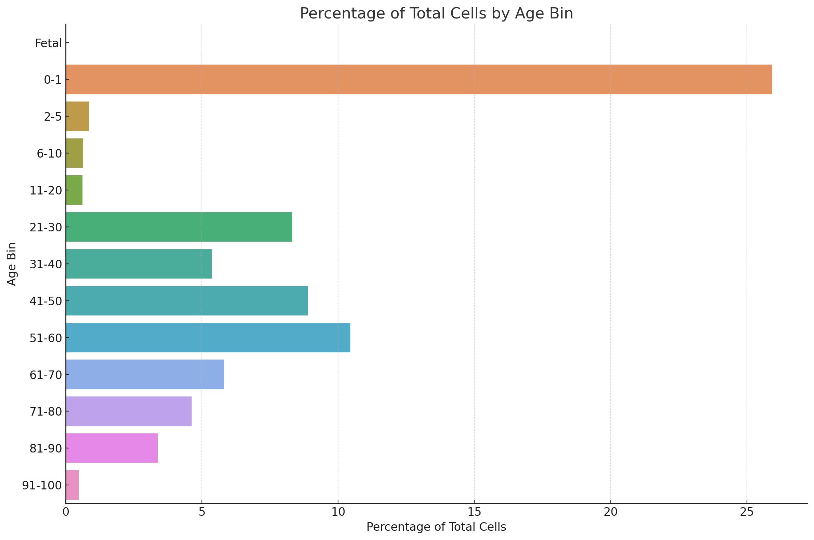
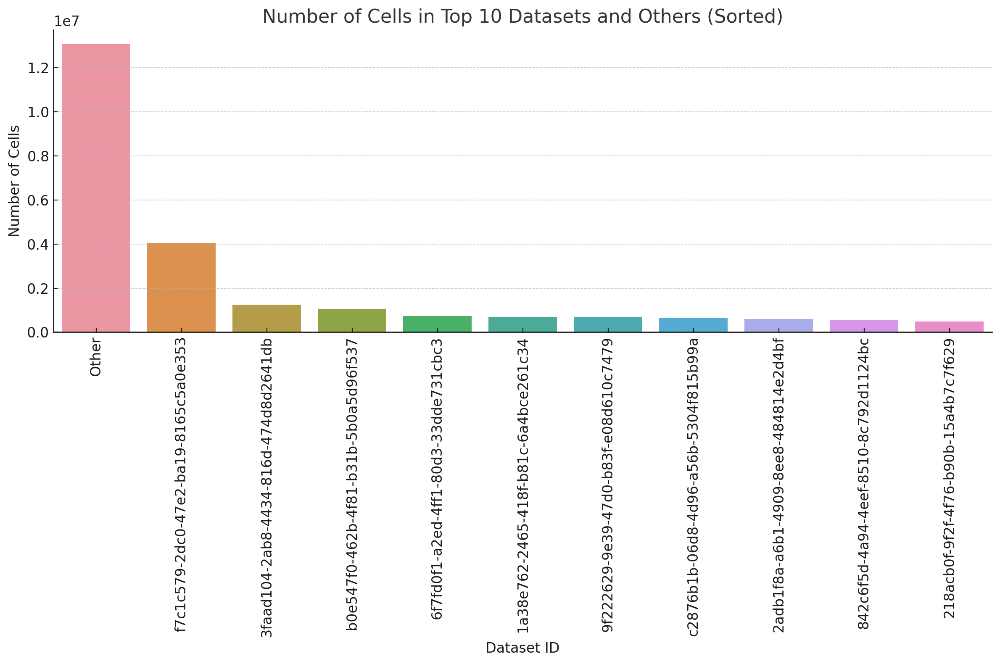

# CELLxGENE

## Description

[CELLxGENE](https://cellxgene.cziscience.com/) is an aggregation of publicly available single-cell datasets collected by CZI.

## Dataset attributes of version 2023-12-15

Data was downloaded using the [CELLxGENE Discover Census version `2023-12-15`](https://chanzuckerberg.github.io/cellxgene-census/cellxgene_census_docsite_data_release_info.html#lts-2023-12-15). We first downloaded cellxgene census version 2023-12-15 using the `cellxgene_census` python API. We limited cell data to `organism=”Homo sapiens”`, with a non “na” `suspension_type`, `is_primary_data=True`, and `disease=”normal”` to limit to non-diseased tissues that are also the primary data source per cell to make sure that cells are only included once in the download. We tracked metadata including “assay”, “sex”, “development_stage”, “tissue_general”, “dataset_id” and “self_reported_ethnicity”. The metadata “assay”, “tissue_general”, and “dataset_id” were used to construct dataset splits into train, validation, and test sets. The training set represented 99% of the downloaded cells. We partitioned the data by dataset_id into a train set (99%) and a hold-out set (1%), to make sure that the hold-out datasets were independently collected single cell experiments, which helps evaluate generalizability to new future datasets. In this training split, we made sure that all “assay” and “tissue_general” labels were present in the training set so that our model would have maximal visibility into different tissues and assay biases. Finally the 1% hold-out set was split further into a validation and test set. This final split was mostly done randomly by cell, however we set aside a full dataset into the test split so that we could evaluate performance after training on a completely unseen dataset, including when monitoring the validation loss during training.

These parameters resulted in 23.87 Million single cells collected from a variety of public datasets, all hosted by CZI cell x gene census. After the splitting procedure we had:

- 23.64 Million cells in the training split
- 0.13 Million cells in the validation split
- 0.11 Million cells in the test split

### Distributions of donor covariates

There are various biases apparent in this dataset.

#### Tissue distribution

At a high level tissues were heavily biased toward the nervous system, which made up nearly 40 percent of the data.

#### Assay distribution

Assays were also imbalanced in this dataset. As the 10x machine is fairly high throughput and currently popular, it makes sense that the majority of cells present would be from this instrument. Various versions of the 10x instrument made up 18M of the 24M cells while the next largest category was `sci-RNA-seq`.

#### Sex distribution

A bias exists in this dataset for sex. Most of the donor's cells were male-derived at 52%, while female donor's cell contribution made up 42%, and the remaining 6% were not annotated.
.

#### Reported ethnicity distribution

The dataset has a heavy bias toward cells derived from donors with european ethnicity at 40%, while the next largest category, asian, made up 8%. When considering that nearly 50% were unknown, we might expect that as much as 75% of this dataset is made up of cells extracted from donors of self reported european ethnicity.

#### Age distribution

This dataset is very heavily balanced toward younger donors. Many of the cells are derived from donors that are under a year of age (over 25%). After that the remaining 75% of cells are dispersed roughly under a normal distribution with a mode of 51-60 other than an additional peak in the 21-30 range. Donors over 61 years old make up approximately 15% of the data.

#### Assay size distribution

Different assays have different ranges of reported gene measurements. On the low end `BD Rapsody Targetted mRNA` has only a few genes reported, while 10x instruments tend to report on 30,000 genes.

#### Dataset distribution

Dataset (eg a publication that produces data and uploads to cellxgene) leads to known batch effects due to different handling proceedures, collection procedures, etc. We stratify our training vs hold-out split by this covariate for this reason. Exploring the breakdown of datasets we see that the top 10 datsets represent approximately 10 million cells of the full cellxgene datset. The largest dataset alone has 4 million cells.

Looking at the makeup of these top datasets, we see that most represent single tissue categories predominately. Most of these tend to be nervous system datsets with the exception of one which is balanced between many cell types.

## References

- [CZ CELLxGENE Discover](https://doi.org/10.1101/2023.10.30.563174): A single-cell data platform for scalable exploration, analysis and modeling of aggregated data CZI Single-Cell Biology, et al. bioRxiv 2023.10.30; doi: https://doi.org/10.1101/2023.10.30.563174
