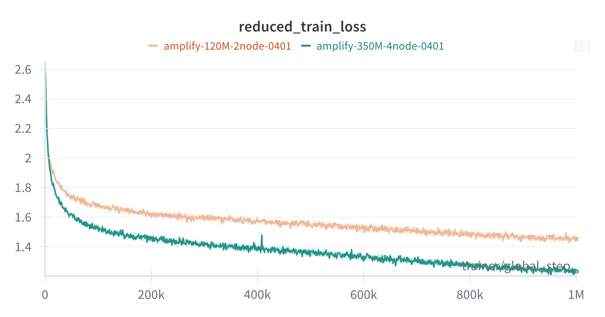
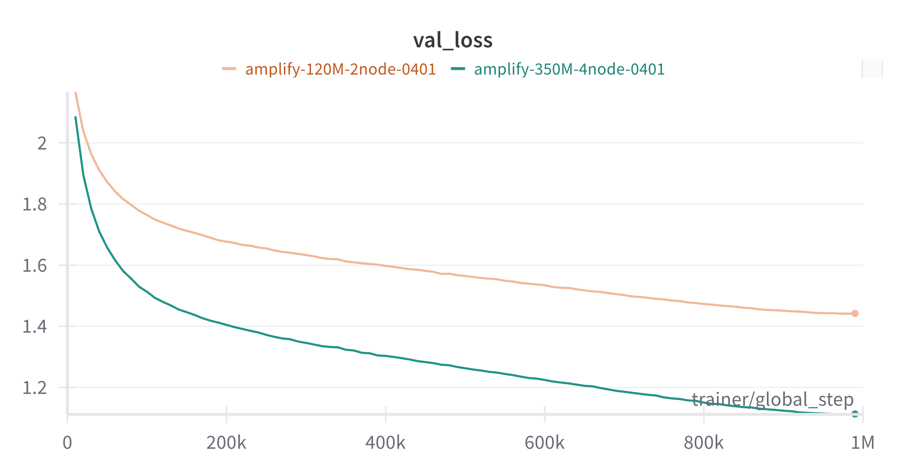
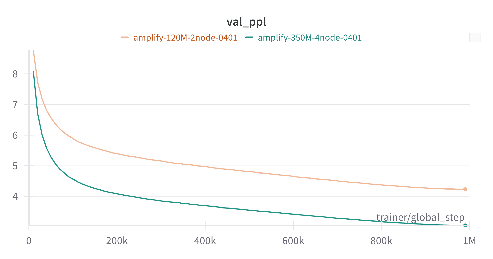

## Model Overview

A NeMo and Megatron-LM compatible version of the AMPLIFY model
(https://www.biorxiv.org/content/10.1101/2024.09.23.614603v1), a protein language model variant of ESM-2 with modified
layer structure and dataset construction.

The model is fully compatible with weights distributed via HuggingFace
(https://huggingface.co/chandar-lab/AMPLIFY_120M). To initialize a NeMo version of AMPLIFY from a huggingface tag, use
the provided `HFAMPLIFYImporter`:

```python
module = biobert_lightning_module(config=AMPLIFYConfig())
io.import_ckpt(module, f"hf://chandar-lab/AMPLIFY_120M", tmp_path / "nemo_checkpoint")
```

## Pre-training Performance

??? Example pre-training commands

    === "120M"

        ```
        python /workspace/bionemo-framework/sub-packages/bionemo-amplify/src/bionemo/amplify/train_amplify.py \
            ...
            --num-nodes=2 \
            --devices=8 \
            --min-seq-length 512 \
            --max-seq-length 512 \
            --num-layers 24 \
            --num-attention-heads 10 \
            --hidden-size 640 \
            --ffn-hidden-size 2560 \
            --micro-batch-size 256
        ```

    === "350M"

        ```
        python /workspace/bionemo-framework/sub-packages/bionemo-amplify/src/bionemo/amplify/train_amplify.py \
            ...
            --num-nodes=4 \
            --devices=8 \
            --min-seq-length 512 \
            --max-seq-length 512 \
            --num-layers 32 \
            --num-attention-heads 15 \
            --hidden-size 960 \
            --ffn-hidden-size 3840 \
            --micro-batch-size 128
        ```

| Model Size | GPUs             | Batch Size (per GPU) | Training Step Time (s) |
| ---------- | ---------------- | -------------------- | ---------------------- |
| 120M       | 16 x NVIDIA H100 | 256                  | 0.461                  |
| 350M       | 32 x NVIDIA H100 | 128                  | 0.525                  |

## Model Convergence








## Final perplexities by model size

| Model Size | Perplexity at 1M steps |
| ---------- | ---------------------- |
| 120M       | 4.23                   |
| 350M       | 3.05                   |
