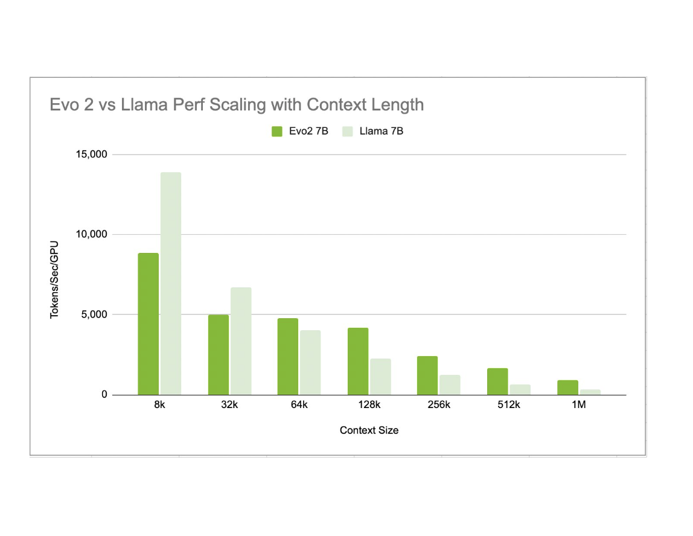
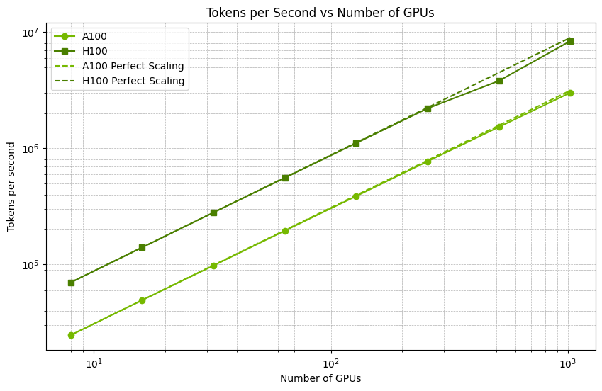

## Model Overview

### Description:

Evo 2 is a genomic foundation model that enables prediction and generation tasks from the molecular to genome scale. At 40 billion parameters, the model understands the genetic code for all domains of life and is the largest AI model for biology to date. Evo 2 was trained on a dataset of nearly 9 trillion nucleotides.

This model is ready for commercial use.

### Third-Party Community Consideration

This model is not owned or developed by NVIDIA. This model has been developed and built to a third-party’s requirements for this application and use case; see [Arc Institute web site](https://arcinstitute.org).

### License/Terms of Use:

GOVERNING TERMS: The NIM container is governed by the [NVIDIA Software License Agreement](https://www.nvidia.com/en-us/agreements/enterprise-software/nvidia-software-license-agreement/) and [Product-Specific Terms for AI Products](https://www.nvidia.com/en-us/agreements/enterprise-software/product-specific-terms-for-ai-products/). Use of this model is governed by the [NVIDIA Open Model License Agreement](https://www.nvidia.com/en-us/agreements/enterprise-software/nvidia-open-model-license/). ADDITIONAL INFORMATION: [Apache 2.0 License](https://github.com/ArcInstitute/evo2/blob/main/LICENSE).

You are responsible for ensuring that your use of NVIDIA AI Foundation Models complies with all applicable laws.

### Deployment Geography:

Global

### Use Case:

Evo is able to perform zero-shot function prediction for genes. Evo also can perform multi-element generation tasks, such as generating synthetic CRISPR-Cas molecular complexes. Evo 2 can also predict gene essentiality at nucleotide resolution and can generate coding-rich sequences up to 1 million in length. Advances in multi-modal and multi-scale learning with Evo provides a promising path toward improving our understanding and control of biology across multiple levels of complexity.

### Release Date:

2/19/2025

### Acknowledgements:

```
@article{nguyen2024sequence,
   author = {Eric Nguyen and Michael Poli and Matthew G. Durrant and Brian Kang and Dhruva Katrekar and David B. Li and Liam J. Bartie and Armin W. Thomas and Samuel H. King and Garyk Brixi and Jeremy Sullivan and Madelena Y. Ng and Ashley Lewis and Aaron Lou and Stefano Ermon and Stephen A. Baccus and Tina Hernandez-Boussard and Christopher Ré and Patrick D. Hsu and Brian L. Hie },
   title = {Sequence modeling and design from molecular to genome scale with Evo},
   journal = {Science},
   volume = {386},
   number = {6723},
   pages = {eado9336},
   year = {2024},
   doi = {10.1126/science.ado9336},
   URL = {https://www.science.org/doi/abs/10.1126/science.ado9336},
}
```

```
@article {merchant2024semantic,
   author = {Merchant, Aditi T and King, Samuel H and Nguyen, Eric and Hie, Brian L},
   title = {Semantic mining of functional de novo genes from a genomic language model},
   year = {2024},
   doi = {10.1101/2024.12.17.628962},
   publisher = {Cold Spring Harbor Laboratory},
   URL = {https://www.biorxiv.org/content/early/2024/12/18/2024.12.17.628962},
   journal = {bioRxiv}
}
```

### Model Architecture:

**Architecture Type:** Generative Neural Network

**Network Architecture:** StripedHyena

### Input:

**Input Type(s):** Text

**Input Format(s):** DNA Sequence (String)

**Input Parameters:** One-Dimensional (1D)

### Output:

**Output Type(s):** Text

**Output Format:** DNA Sequence (String)

**Output Parameters:** One-Dimensional (1D)

### Software Integration:

**Runtime Engine(s):**
* PyTorch
* Transformer Engine

**Supported Hardware Microarchitecture Compatibility:**
* NVIDIA Hopper

**[Preferred/Supported] Operating System(s):**
* Linux

### Model Version(s):

evo2-40b:1.0.0

## Training, Testing, and Evaluation Datasets:

Multiple datasets were used for training, testing and evaluation (see details below.

*OpenGenome*
Link: [Sequence modeling and design from molecular to genome scale with Evo](https://www.science.org/doi/10.1126/science.ado9336)
Data Collection Method: Automatic/Sensors/Human
Labeling Method by dataset: Automatic
The previously published OpenGenome dataset was used in its entirety as part of the training data for this study. This included representative prokaryotic genomes available through GTDB release v214.1, and curated phage and plasmid sequences retrieved through IMG/VR and IMG/PR.

*Updated GTDB prokaryotic genomes*
Link: [GTDB: an ongoing census of bacterial and archaeal diversity through a phylogenetically consistent, rank normalized and complete genome-based taxonomy](https://academic.oup.com/nar/advance-article/doi/10.1093/nar/gkab776/6370255)
Data Collection Method: Automatic/Sensors/Human
Labeling Method by dataset: Automatic
New prokaryotic reference genomes made available through the GTDB release 220.0 update were added to the training data for this study. New genomes were identified by selecting all species’ reference genomes that had no previously published (release 214.1) genomes within their species cluster, resulting in 28,174 additional prokaryotic genomes.

*NCBI Eukaryotic reference genomes*
Link: [Mash: fast genome and metagenome distance estimation using MinHash](https://genomebiology.biomedcentral.com/articles/10.1186/s13059-016-0997-x)
Data Collection Method: Automatic/Sensors/Human
Labeling Method by dataset: Automatic
All available eukaryotic reference genomes were downloaded from NCBI on 05/32/2024, excluding atypical genomes, metagenome-assembled genomes, and genomes from large multi-isolate projects. This resulted in 16,704 genomes including an estimated \~10.7 trillion nucleotides. Only contigs that were annotated as ‘Primary Assembly’, ‘non-nuclear’, or ‘aGasCar1.hap1’ (an aberrant annotation that applied only to GCA\_027917425.1) were retained. Mash sketch was run on each individual genome with the flag “-s 10000” and the mash distance was calculated between all genomes as an estimate for their pairwise 1-ANI (average nucleotide identity). All genomes with a mash distance \< 0.01 were joined with edges in a graph, and clusters were identified by finding connected components. One representative genome per cluster was chosen, prioritizing genomes with a higher assembly level and genomes with longer total sequence length. This clustering resulted in 15,148 candidate genomes. Genomes were further filtered by removing ambiguous nucleotides at the termini of each contig, by removing regions annotated as “centromere” in an available GFF file, and by removing contigs that were less than 10 kb in total length. Finally, contigs that were composed of more than 5% ambiguous nucleotides were removed. This final filtered set included 15,032 genomes and 6.98 trillion nucleotides.

Bridge Metagenomic Data
Link: [Bridge RNAs direct programmable recombination of target and donor DNA](https://www.nature.com/articles/s41586-024-07552-4)
Data Collection Method: Automatic/Sensors/Human
Labeling Method by dataset: Automatic
A previously described metagenomics dataset was further curated as part of the training data. This included 41,253 metagenomes and metagenome-assembled genomes from NCBI, JGI IMG, MGnify, MG-RAST, Tara Oceans samples, and Youngblut et al. animal gut metagenomes.  All contigs were split at consecutive stretches of ambiguous nucleotides of length 5 bp or longer, the split contigs were filtered by a minimum sequence length of 1 kb, and only contigs with at least one open reading frame as predicted by prodigal were kept. Contig-encoded proteins were previously clustered at 90% identity using MMseqs. To further remove redundant sequences, contigs were sorted by descending length, and each contig was only retained if at least 90% of its respective protein clusters were not already in the sequence collection (determined using a bloom filter).

*NCBI Organelle*
Link: [NCBI Organelle Genome Data Package](https://www.ncbi.nlm.nih.gov/datasets/organelle/?taxon=2759)
Data Collection Method: Automatic/Sensors/Human
Labeling Method by dataset: Automatic
Eukaryotic organelle genomes: (at the time of data query) 33,457 organelle genomes were identified and downloaded using the “NCBI Organelle” web resource. Ambiguous nucleotides at the terminal ends of the organelle genome sequences were removed. Sequences that had over 25 ambiguous nucleotides were removed. This resulted in 32,241 organelle genomes that were used for training, including 1,613 mitochondria, 12,856 chloroplasts, 1,751 plastids, 18 apicoplasts, 1 cyanelle, and 1 kinetoplast.

### Inference:

**Engine:** PyTorch, Transformer Engine

**Test Hardware:**

* H200 (1 and 2 GPU configurations, 144 GB each)
* H100 (2 GPU configuration, 80 GB each)

## Ethical Considerations:

NVIDIA believes Trustworthy AI is a shared responsibility and we have established policies and practices to enable development for a wide array of AI applications.  When downloaded or used in accordance with our terms of service, developers should work with their internal model team to ensure this model meets requirements for the relevant industry and use case and addresses unforeseen product misuse.

Users are responsible for ensuring the physical properties of model-generated molecules are appropriately evaluated and comply with applicable safety regulations and ethical standards.

Please report security vulnerabilities or NVIDIA AI Concerns [here](https://www.nvidia.com/en-us/support/submit-security-vulnerability/).


## Training diagnostics

## Benchmarking

### Performance vs context length
With the current implementation of Evo2, we do not have the heavily optimized kernels in place for convolution operators like we do for
attention layers in a model like llama2. Even with this shortcoming, we see that the benefit from including more convolutional layers
makes up for the earlier stage of optimization at around the 64k context length. Beyond that point we see an improvement
in performance even compared to a highly optimized transformer model.



### Performance vs cluster size
Performance scales linearly with a very small overhead on a cluster with fast interconnects.

