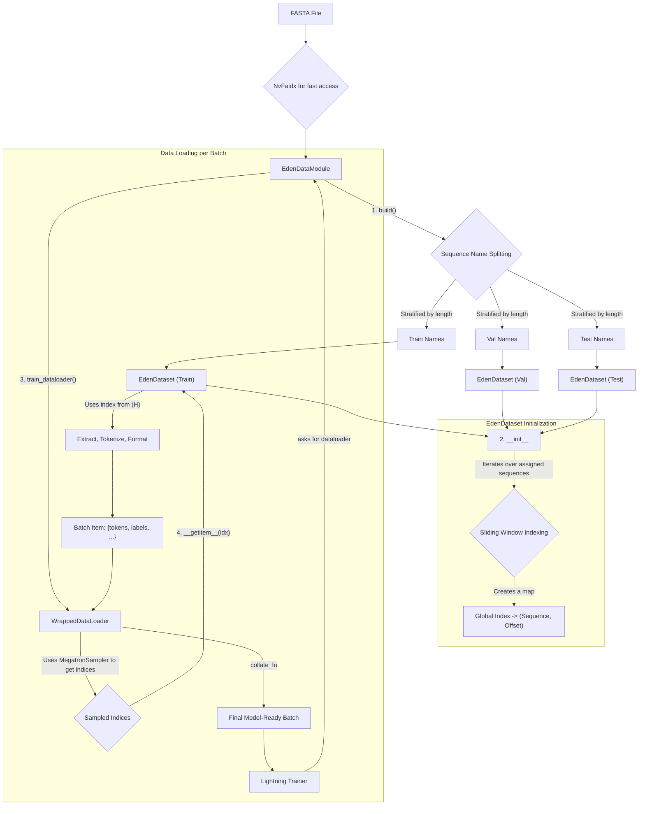

# `eden_dataloader.py` Implementation Analysis

## 1. Overview

The `eden_dataloader.py` script provides a robust and scalable data loading solution for training large language models on genomic sequence data. It is designed to work with FASTA files and integrates seamlessly with the NeMo and PyTorch Lightning frameworks. The core components are `EdenDataModule`, which manages the overall data lifecycle (splitting, dataloader creation), and `EdenDataset`, which handles the low-level details of sequence extraction, tokenization, and formatting into model-ready batches.

The key design principle is to efficiently handle massive genomic datasets by creating a virtual dataset of overlapping "windows" from the source sequences, without loading the entire dataset into memory.

## 2. Data Flow Diagram

## 3. Core Components

### `EdenDataModule`

This class is a `lightning.pytorch.LightningDataModule` and serves as the main entry point for the data loading pipeline. Its responsibilities include:

-   **Configuration**: Accepts parameters like file paths, sequence length, batch sizes, and tokenizer settings.
-   **Dataset Splitting**:
    -   It reads all sequence names from the `.fai` index of the input FASTA file.
    -   To ensure that the training, validation, and test sets have a similar distribution of sequence lengths, it first categorizes sequences into `short`, `medium`, and `long` groups.
    -   It then splits each length category according to the specified `train_val_test_split` ratios.
    -   Finally, it combines the splits from each category to form the final train, validation, and test sets of sequence names.
-   **Dataset Instantiation**: Creates separate `EdenDataset` instances for the training, validation, and test sets, passing the corresponding list of sequence names to each.
-   **Dataloader Creation**: Wraps each `EdenDataset` in a `nemo.lightning.data.WrappedDataLoader`, which integrates with the `MegatronDataSampler` for efficient distributed training.
-   **Checkpointing**: Implements `state_dict` and `load_state_dict` to save and restore the data consumption state, ensuring reproducibility and proper resumption of training.

### `EdenDataset`

This class is a `torch.utils.data.Dataset` that handles the core logic of transforming raw sequence data into model inputs.

-   **Virtual Window Indexing**: This is the core mechanism for creating a large, iterable dataset without high memory usage. The dataset is an "index of windows," not sequences. The process is as follows:
    1.  The `__init__` method iterates through its assigned sequence names.
    2.  For each sequence, it calculates the number of overlapping windows that can be extracted.
    3.  It maintains a running total of windows (`total_windows`).
    4.  It builds a metadata list, `self.sequence_index`. Each entry is a simplified tuple `(name, start_idx, seq_len)` representing one original sequence.
        -   `name`: The name of the sequence (e.g., "chr1").
        -   `start_idx`: The **global starting window index** for this sequence.
        -   `seq_len`: The total length of the original sequence.
    5.  The total length of the dataset (`__len__`) is set to the final `total_windows` count.
    6.  A NumPy array, `self.starts`, is created containing only the `start_idx` values. This is memory-efficient and enables a very fast C-backed lookup.

-   **On-the-fly Data Fetching (`__getitem__`)**: When the dataloader requests an item at a global window index `idx`:
    1.  **Find the Sequence**: It uses `numpy.searchsorted(self.starts, idx, side='right')` to perform a highly optimized binary search on the `self.starts` array, instantly identifying which sequence the window `idx` belongs to.
    2.  **Calculate Relative Position**: It retrieves the sequence's metadata and calculates the window's index *relative* to that sequence: `rel_idx = idx - start_idx`.
    3.  **Calculate Read Position**: It calculates the exact start position in the FASTA file: `start_pos = rel_idx * self.stride`.
    4.  **Fetch and Process**: It then uses `NvFaidx` to seek and read the subsequence, tokenize it, create labels, and return the final dictionary.

## 4. Step-by-Step Data Loading Process

1.  **Initialization**: An `EdenDataModule` is created with the desired configuration.
2.  **Setup (`setup` method)**: The Lightning `Trainer` calls the `setup` method.
3.  **Build (`build` method)**:
    -   `EdenDataModule` reads sequence headers from the FASTA index (`.fai` file).
    -   It shuffles and splits these headers into train, validation, and test sets, stratified by length.
    -   It instantiates three `EdenDataset` objects, one for each split.
4.  **Dataset Indexing**: This is the crucial step where the virtual dataset of windows is created.
    -   Each `EdenDataset` instance calculates how many fixed-size windows can be extracted from its assigned sequences.
    -   It builds the metadata index that maps a flat, global window index to a specific location within a sequence. Let's imagine a simple dataset with two sequences:
        -   Sequence A produces 100 windows.
        -   Sequence B produces 50 windows.
    -   The `sequence_index` list would look like this: `[('A', 0, len_A), ('B', 100, len_B)]`.
    -   The total dataset length (`self.length`) would be 150.
    -   The `self.starts` NumPy array for the lookup would be `[0, 100]`.
5.  **Dataloader Request**: The `Trainer` requests a dataloader (e.g., `train_dataloader`).
6.  **Batch Creation**:
    -   The `MegatronDataSampler` provides a series of indices to the `EdenDataset` (e.g., it might request window `idx=120`).
    -   For each index, `EdenDataset.__getitem__` is called, which performs the on-the-fly data extraction, tokenization, and formatting as described above.
    -   The `default_collate` function stacks these individual sample dictionaries into a single batch dictionary of tensors.
7.  **Training**: The final batch is passed to the model for a training step.

## 5. Key Features

-   **Sliding Window Mechanism**: Efficiently creates a large dataset of overlapping sequence windows from a smaller set of long sequences, maximizing data utilization.
-   **Memory Efficiency**: By using `NvFaidx` and on-the-fly processing, the dataloader avoids loading entire large FASTA files into RAM. Only sequence metadata and the current batch are held in memory.
-   **Stratified Splitting**: Ensures that all data splits (train/val/test) have a representative distribution of sequence lengths, which can improve model generalization and lead to more stable validation metrics.
-   **Reverse-Complement Augmentation**: Doubles the effective size of the dataset by randomly providing either the forward or the reverse-complement strand of a sequence, a standard and effective augmentation technique in genomics.
-   **Control Tags**: Allows for metadata to be embedded into the sequence as special tokens (e.g., species name), which can be used by the model to learn context-specific representations.
-   **Megatron-Core Integration**: Natively uses `MegatronDataSampler` and handles the necessary logic for saving and loading consumed sample states, making it suitable for large-scale, distributed training with model and pipeline parallelism.

## 6. Performance Analysis and Remediation

While the current implementation is highly memory-efficient, its reliance on on-the-fly processing introduces potential performance bottlenecks, especially when scaling to a large number of workers or when the GPU processing time per batch is very short.
