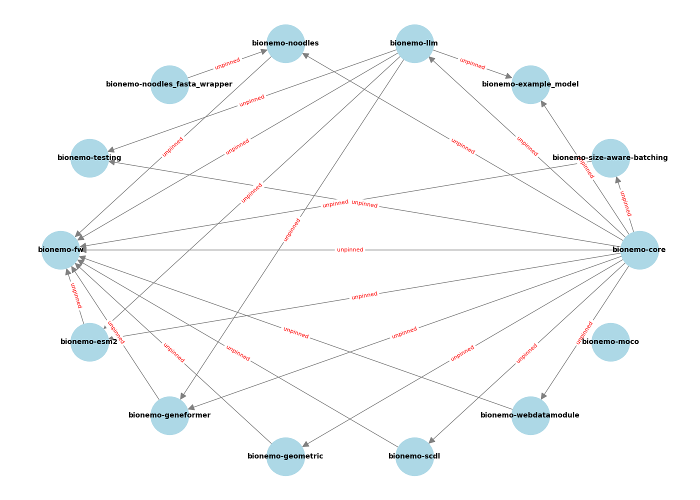
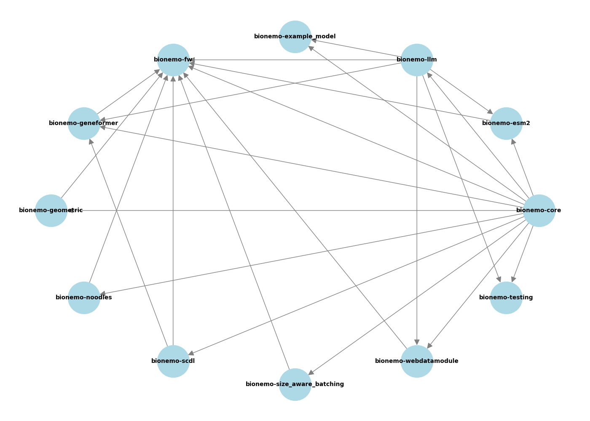
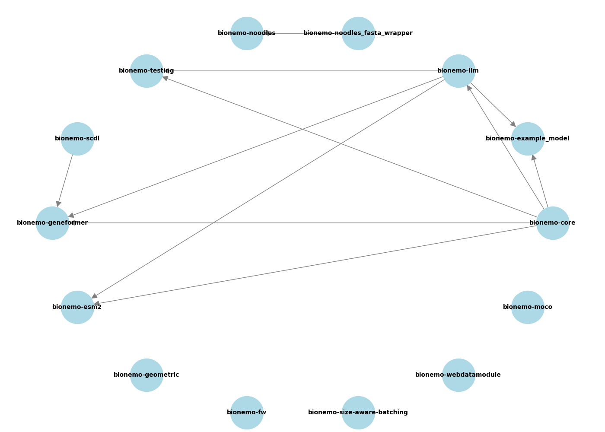

# bionemo-fw

The BioNeMo Framework (FW): a production grade framework for AI-enabled Drug Discovery.

The `bionemo-fw` Python package contains framework-spanning code under the `bionemo.fw` namespace.
All other namespaces of the BioNeMo Framework (`bionemo.*`) are dependencies of this package.

## Developer Setup
After following the setup specified in the [README](https://github.com/NVIDIA/bionemo-framework/blob/main/README.md),
you may install this project's code in your environment via executing:
```bash
pip install -e .
```

To run unit tests with code coverage, execute:
```bash
pytest -v --cov=bionemo --cov-report=term .
```

## Dependency Graph

The script in `bionemo/fw/src/dependency_graph.py` generates a dependency graph for the BioNeMo sub-packages and verifies that the pyproject.toml and tach.toml files align capture the dependencies needed for imports in the python files. Additionally, it checks dependencies between BioNeMo sub-packages and creates visual representations of the dependencies in pyproject.toml files, in tach.toml, and in the source files.

These are visualizations of the dependency graph from the pyproject.toml files:




Similarly from the tach.toml file:




And these are the dependencies from the file imports:


